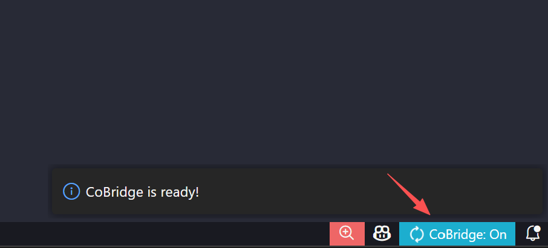
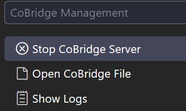
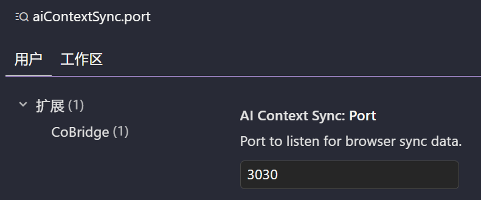

# CoBridge — 让 AI 拥有"共享记忆"的次元桥✨

[English](../README.md) | [简体中文](README_CN.md) | [繁體中文](README_ZH_TW.md) | [日本語](README_JA.md) | [Français](README_FR.md) | [Español](README_ES.md) | [Português](README_PT.md) | [한국어](README_KO.md) | [Русский](README_RU.md) | [العربية](README_AR.md)

[](https://marketplace.visualstudio.com/items?itemName=windfall.co-bridge)
[](https://marketplace.visualstudio.com/items?itemName=windfall.co-bridge)
[](https://open-vsx.org/extension/windfall/co-bridge)
[](https://github.com/Winddfall/CoBridge/blob/master/LICENSE)
[](https://github.com/Winddfall/CoBridge/stargazers)
[](https://github.com/Winddfall/CoBridge/commits/master)

> [!IMPORTANT]
> **CoBridge 需要搭配浏览器插件 [Voyager](https://github.com/Nagi-ovo/gemini-voyager) 才能发挥作用**。
> CoBridge 负责在 IDE 端接收并管理上下文，Voyager 负责在网页端抓取并发送对话内容。两者"合体"后，你的 IDE 助手才能真正看懂网页里的聊天记录！

## ⚡️ 支持生态 (Supported Ecosystem)


![Codex](https://img.shields.io/badge/Codex-5865F2?style=for-the-badge&logo=data:image/svg+xml;base64,PHN2ZyBmaWxsPSIjRkZGRkZGIiBmaWxsLXJ1bGU9ImV2ZW5vZGQiIGhlaWdodD0iMWVtIiBzdHlsZT0iZmxleDpub25lO2xpbmUtaGVpZ2h0OjEiIHZpZXdCb3g9IjAgMCAyNCAyNCIgd2lkdGg9IjFlbSIgeG1sbnM9Imh0dHA6Ly93d3cudzMub3JnLzIwMDAvc3ZnIj48dGl0bGU+Q29kZXg8L3RpdGxlPjxwYXRoIGNsaXAtcnVsZT0iZXZlbm9kZCIgZD0iTTguMDg2LjQ1N2E2LjEwNSA2LjEwNSAwIDAxMy4wNDYtLjQxNWMxLjMzMy4xNTMgMi41MjEuNzIgMy41NjQgMS43YS4xMTcuMTE3IDAgMDAuMTA3LjAyOWMxLjQwOC0uMzQ2IDIuNzYyLS4yMjQgNC4wNjEuMzY2bC4wNjMuMDMuMTU0LjA3NmMxLjM1Ny43MDMgMi4zMyAxLjc3IDIuOTE4IDMuMTk4LjI3OC42NzkuNDE4IDEuMzg4LjQyMSAyLjEyNmE1LjY1NSA1LjY1NSAwIDAxLS4xOCAxLjYzMS4xNjcuMTY3IDAgMDAuMDQuMTU1IDUuOTgyIDUuOTgyIDAgMDExLjU3OCAyLjg5MWMuMzg1IDEuOTAxLS4wMSAzLjYxNS0xLjE4MyA1LjE0bC0uMTgyLjIyYTYuMDYzIDYuMDYzIDAgMDEtMi45MzQgMS44NTEuMTYyLjE2MiAwIDAwLS4xMDguMTAyYy0uMjU1LjczNi0uNTExIDEuMzY0LS45ODcgMS45OTItMS4xOTkgMS41ODItMi45NjIgMi40NjItNC45NDggMi40NTEtMS41ODMtLjAwOC0yLjk4Ni0uNTg3LTQuMjEtMS43MzZhLjE0NS4xNDUgMCAwMC0uMTQtLjAzMmMtLjUxOC4xNjctMS4wNC4xOTEtMS42MDQuMTg1YTUuOTI0IDUuOTI0IDAgMDEtMi41OTUtLjYyMiA2LjA1OCA2LjA1OCAwIDAxLTIuMTQ2LTEuNzgxYy0uMjAzLS4yNjktLjQwNC0uNTIyLS41NTEtLjgyMWE3Ljc0IDcuNzQgMCAwMS0uNDk1LTEuMjgzIDYuMTEgNi4xMSAwIDAxLS4wMTctMy4wNjQuMTY2LjE2NiAwIDAwLjAwOC0uMDc0LjExNS4xMTUgMCAwMC0uMDM3LS4wNjQgNS45NTggNS45NTggMCAwMS0xLjM4LTIuMjAyIDUuMTk2IDUuMTk2IDAgMDEtLjMzMy0xLjU4OSA2LjkxNSA2LjkxNSAwIDAxLjE4OC0yLjEzMmMuNDUtMS40ODQgMS4zMDktMi42NDggMi41NzctMy40OTMuMjgyLS4xODguNTUtLjMzNC44MDItLjQzOC4yODYtLjEyLjU3My0uMjIuODYxLS4zMDRhLjEyOS4xMjkgMCAwMC4wODctLjA4N0E2LjAxNiA2LjAxNiAwIDAxNS42MzUgMi4zMUM2LjMxNSAxLjQ2NCA3LjEzMi44NDYgOC4wODYuNDU3em0tLjgwNCA3Ljg1YS44NDguODQ4IDAgMDAtMS40NzMuODQybDEuNjk0IDIuOTY1LTEuNjg4IDIuODQ4YS44NDkuODQ5IDAgMDAxLjQ2Ljg2NGwxLjk0LTMuMjcyYS44NDkuODQ5IDAgMDAuMDA3LS44NTRsLTEuOTQtMy4zOTN6bTUuNDQ2IDYuMjRhLjg0OS44NDkgMCAwMDAgMS42OTVoNC44NDhhLjg0OS44NDkgMCAwMDAtMS42OTZoLTQuODQ4eiI+PC9wYXRoPjwvc3ZnPg==)

**一边在网页端和 AI "头脑风暴"，一边在 IDE/CLI 里让 Agent 写代码——却发现它们彼此失忆？**

CoBridge 就是那座"次元桥"：它把你在浏览器里与 AI 的聊天记录，瞬间搬运到本地 ，让 Copilot、Cursor、Claude Code 这些 Agent 也能读懂你的思路。

> 大脑在云端，双手在本地——从此同频呼吸。

---

## 🚀 三步起飞

### 1. 安装 CoBridge

打开 VS Code 插件市场，搜索 **CoBridge**，点击安装。就这么简单。

### 2. 确认服务已启动

安装完毕后，瞄一眼右下角状态栏——看到 `CoBridge: On` 就说明桥已经搭好了（默认端口 `3030`）。



点击这个小图标，你可以：
- 手动 **开/关** 服务  
- **查看日志**（出问题先看这里）  
- **打开同步文件**（看看 AI 记住了什么）
- **清空同步文件**（清空 AI 的记忆）



### 3. 开始"记忆搬运"

确保浏览器端的 **Gemini Voyager** 已开启"上下文同步"功能。点击 **同步到IDE**，对话内容就会自动落地到：

```
.cobridge/AI_CONTEXT.md
```

从此，你的 IDE 助手再也不会一脸茫然地问你“你之前说了什么？”

---

## ⚙️ 端口被占了？换一个！

默认端口 `3030` 如果被其他程序"霸占"了，改起来也很简单：

1. 打开 VS Code 设置（`Ctrl + ,` / `Cmd + ,`）
2. 搜索 `AIContextSync.port`
3. 把端口号改成你喜欢的数字（比如 `3031`）
4. 在状态栏菜单里重启一下服务，搞定！

**由于vscode会以工作区设置覆盖用户设置，所以请在工作区设置中修改端口号**



---

## 📋 你需要准备什么

| 需求 | 说明 |
|------|------|
| **VS Code** | `1.50.0` 或更高版本 |
| **浏览器插件** | 需要配套的 [Gemini Voyager](https://github.com/Nagi-ovo/gemini-voyager) 来抓取对话 |
| **网络** | 确保 `127.0.0.1` 没被防火墙挡住 |

---

## 🎯 它的原则

- **零污染**：CoBridge 会自动把同步文件加入 `.gitignore`，绝不污染你的 Git 仓库。你的"悄悄话"只属于你自己。
- **格式友好**：全 Markdown 输出，IDE 里的 AI 读起来就像读说明书一样丝滑。
- **自动配置**：它还会帮你更新规则文件，让各路 AI 助手无缝读取上下文。

---

## ⚠️ 已知的小脾气

| 状态 | 说明 |
|------|------|
| ✅ **已支持** | Gemini |
| ✅ **表格支持** | 已支持同步表格 |
| ✅ **图片支持** | 已支持同步图片 |
| ❌ **暂不支持** | 某些反爬严格或 DOM 结构复杂的平台（欢迎 PR！）|
| ❌ **文件附件支持** | 暂不支持 |

---

## 🌟 一句话总结

**大模型从此不再失忆，在网页端聊透方案，在 IDE 里直接落地。**

如果这个项目帮到了你，欢迎去 [GitHub](https://github.com/Winddfall/CoBridge) 点个 Star ⭐

## 💡 提问

如果你有新的需求，欢迎在 [GitHub](https://github.com/Winddfall/CoBridge/issues) 提 issue。

## 🤝 贡献

如果你有好的建议或发现 bug，欢迎提交 Pull Request！

## 📄 许可证

该项目采用 MIT 许可证。

