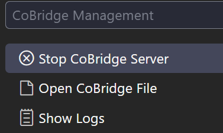

# CoBridge — AIに「共有メモリ」を持たせる次元の架け橋✨

[English](../README.md) | [简体中文](README_CN.md) | [繁體中文](README_ZH_TW.md) | [日本語](README_JA.md) | [Français](README_FR.md) | [Español](README_ES.md) | [Português](README_PT.md) | [한국어](README_KO.md) | [Русский](README_RU.md) | [العربية](README_AR.md)

[](https://marketplace.visualstudio.com/items?itemName=windfall.co-bridge)
[](https://marketplace.visualstudio.com/items?itemName=windfall.co-bridge)
[](https://open-vsx.org/extension/windfall/co-bridge)
[](https://github.com/Winddfall/CoBridge/blob/master/LICENSE)
[](https://github.com/Winddfall/CoBridge/stargazers)
[](https://github.com/Winddfall/CoBridge/commits/master)

> [!IMPORTANT]
> **CoBridgeが機能するには、[Gemini Voyager](https://github.com/Nagi-ovo/gemini-voyager) ブラウザ拡張機能が必要です。**
> CoBridgeはIDE側でコンテキストを受信・管理し、Gemini VoyagerはWeb側で会話を取得・送信します。この2つが「合体」することで、初めてシームレスなコンテキスト同期が可能になります！

## ⚡️ サポートされているエコシステム (Supported Ecosystem)


**WebでAIと「ブレインストーミング」し、IDEでコードを書く。でも、お互いの記憶がないことに気づきませんか？**

CoBridgeはまさにその「次元の架け橋」です。ブラウザでのAIとのチャット履歴を瞬時にIDEに転送し、Copilot、Trae、CursorなどのIDEアシスタントがあなたの思考プロセスを理解できるようにします。

> 脳はクラウドに、手はローカルに —— これで息が合います。

---

## 🚀 離陸までの3ステップ

### 1. CoBridgeをインストール

VS Codeの拡張機能マーケットプレイスを開き、**CoBridge** を検索してインストールをクリックします。とても簡単です。

### 2. サービスの起動を確認

インストール後、右下のステータスバーを見てください。`CoBridge: On` と表示されていれば、架け橋の準備は完了です（デフォルトポート `3030`）。


このアイコンをクリックすると、以下のことができます：
- 手動でサービスの **オン/オフ**
- **ログの表示**（問題が発生した場合はここを確認）
- **同期ファイルを開く**（AIが何を記憶しているか確認）
- **同期ファイルをクリア**（AIの記憶を消去）



### 3. 「記憶の転送」を開始

ブラウザ側の **Gemini Voyager** で「コンテキスト同期」機能が有効になっていることを確認してください。**IDEに同期** をクリックすると、会話の内容が自動的に以下のファイルに保存されます：

```
.cobridge/AI_CONTEXT.md
```

これで、あなたのIDEアシスタントが「前に何を言ったっけ？」と呆然とすることはもうありません。

---

## ⚙️ ポートが使われている？変更しましょう！

デフォルトのポート `3030` が他のプログラムに「占領」されている場合でも、簡単に変更できます：

1. VS Codeの設定を開く（`Ctrl + ,` / `Cmd + ,`）
2. `AIContextSync.port` を検索
3. ポート番号を好きな数字に変更（例：`3031`）
4. ステータスバーのメニューからサービスを再起動すれば完了！

**VS Codeはワークスペース設定がユーザー設定を上書きするため、ワークスペース設定でポート番号を変更してください。**


---

## 📋 必要なもの

| 要件 | 説明 |
|------|------|
| **VS Code** | `1.50.0` 以上 |
| **ブラウザ拡張機能** | 会話を取得するために、対応する [Gemini Voyager](https://github.com/Nagi-ovo/gemini-voyager) が必要です |
| **ネットワーク** | `127.0.0.1` がファイアウォールでブロックされていないことを確認してください |

---

## 🎯 原則

- **汚染ゼロ**：CoBridgeは同期ファイルを自動的に `.gitignore` に追加し、Gitリポジトリを汚染しません。あなたの「内緒話」はあなただけのものです。
- **フレンドリーなフォーマット**：完全なMarkdown出力により、IDE内のAIが説明書を読むようにスムーズに読み取れます。
- **自動設定**：ルールファイルの更新も支援し、さまざまなAIアシスタントがシームレスにコンテキストを読み取れるようにします。

---

## ⚠️ 既知の制限事項

| ステータス | 説明 |
|------|------|
| ✅ **サポート済み** | Gemini |
| ✅ **テーブル対応** | テーブルの同期に対応 |
| ✅ **画像対応** | 画像の同期に対応 |
| ❌ **未サポート** | スクレイピング対策が厳しい、またはDOM構造が複雑なプラットフォーム（PR歓迎！）|
| ❌ **ファイル添付** | 未サポート |

---

## 🌟 一言でまとめると

**大規模言語モデル（LLM）はもう記憶喪失にはなりません。Webで解決策を徹底的に議論し、IDEで直接実装しましょう。**

このプロジェクトが役に立った場合は、[GitHub](https://github.com/Winddfall/CoBridge) でStar ⭐ をお願いします。

## 💡 質問

新しい要望がある場合は、[GitHub](https://github.com/Winddfall/CoBridge/issues) でissueを立ててください。

## 🤝 貢献

良い提案がある場合やバグを見つけた場合は、Pull Requestを歓迎します！

## 📄 ライセンス

このプロジェクトは MIT ライセンスの下で公開されています。
