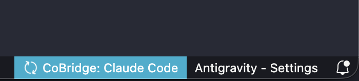
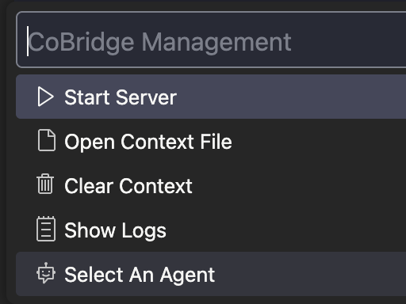
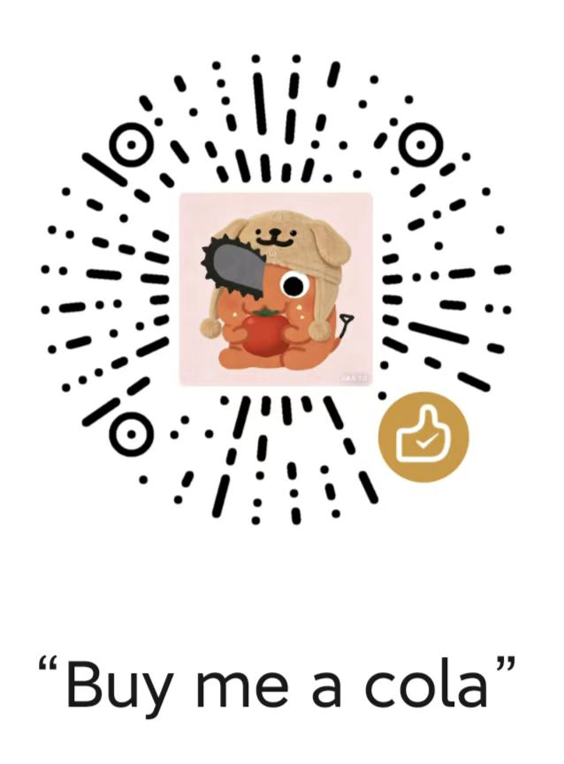

# CoBridge — A Ponte Dimensional para a "Memória Compartilhada" da IA ✨

[English](../README.md) | [简体中文](README_CN.md) | [繁體中文](README_ZH_TW.md) | [日本語](README_JA.md) | [Français](README_FR.md) | [Español](README_ES.md) | [Português](README_PT.md) | [한국어](README_KO.md) | [Русский](README_RU.md) | [العربية](README_AR.md)


![codex](https://img.shields.io/badge/Codex-✓-5865F2?style=flat-square&logo=data:image/svg+xml;base64,PHN2ZyBmaWxsPSIjRkZGRkZGIiBmaWxsLXJ1bGU9ImV2ZW5vZGQiIGhlaWdodD0iMWVtIiBzdHlsZT0iZmxleDpub25lO2xpbmUtaGVpZ2h0OjEiIHZpZXdCb3g9IjAgMCAyNCAyNCIgd2lkdGg9IjFlbSIgeG1sbnM9Imh0dHA6Ly93d3cudzMub3JnLzIwMDAvc3ZnIj48dGl0bGU+Q29kZXg8L3RpdGxlPjxwYXRoIGNsaXAtcnVsZT0iZXZlbm9kZCIgZD0iTTguMDg2LjQ1N2E2LjEwNSA2LjEwNSAwIDAxMy4wNDYtLjQxNWMxLjMzMy4xNTMgMi41MjEuNzIgMy41NjQgMS43YS4xMTcuMTE3IDAgMDAuMTA3LjAyOWMxLjQwOC0uMzQ2IDIuNzYyLS4yMjQgNC4wNjEuMzY2bC4wNjMuMDMuMTU0LjA3NmMxLjM1Ny43MDMgMi4zMyAxLjc3IDIuOTE4IDMuMTk4LjI3OC42NzkuNDE4IDEuMzg4LjQyMSAyLjEyNmE1LjY1NSA1LjY1NSAwIDAxLS4xOCAxLjYzMS4xNjcuMTY3IDAgMDAuMDQuMTU1IDUuOTgyIDUuOTgyIDAgMDExLjU3OCAyLjg5MWMuMzg1IDEuOTAxLS4wMSAzLjYxNS0xLjE4MyA1LjE0bC0uMTgyLjIyYTYuMDYzIDYuMDYzIDAgMDEtMi45MzQgMS44NTEuMTYyLjE2MiAwIDAwLS4xMDguMTAyYy0uMjU1LjczNi0uNTExIDEuMzY0LS45ODcgMS45OTItMS4xOTkgMS41ODItMi45NjIgMi40NjItNC45NDggMi40NTEtMS41ODMtLjAwOC0yLjk4Ni0uNTg3LTQuMjEtMS43MzZhLjE0NS4xNDUgMCAwMC0uMTQtLjAzMmMtLjUxOC4xNjctMS4wNC4xOTEtMS42MDQuMTg1YTUuOTI0IDUuOTI0IDAgMDEtMi41OTUtLjYyMiA2LjA1OCA2LjA1OCAwIDAxLTIuMTQ2LTEuNzgxYy0uMjAzLS4yNjktLjQwNC0uNTIyLS41NTEtLjgyMWE3Ljc0IDcuNzQgMCAwMS0uNDk1LTEuMjgzIDYuMTEgNi4xMSAwIDAxLS4wMTctMy4wNjQuMTY2LjE2NiAwIDAwLjAwOC0uMDc0LjExNS4xMTUgMCAwMC0uMDM3LS4wNjQgNS45NTggNS45NTggMCAwMS0xLjM4LTIuMjAyIDUuMTk2IDUuMTk2IDAgMDEtLjMzMy0xLjU4OSA2LjkxNSA2LjkxNSAwIDAxLjE4OC0yLjEzMmMuNDUtMS40ODQgMS4zMDktMi42NDggMi41NzctMy40OTMuMjgyLS4xODguNTUtLjMzNC44MDItLjQzOC4yODYtLjEyLjU3My0uMjIuODYxLS4zMDRhLjEyOS4xMjkgMCAwMC4wODctLjA4N0E2LjAxNiA2LjAxNiAwIDAxNS42MzUgMi4zMUM2LjMxNSAxLjQ2NCA3LjEzMi44NDYgOC4wODYuNDU3em0tLjgwNCA3Ljg1YS44NDguODQ4IDAgMDAtMS40NzMuODQybDEuNjk0IDIuOTY1LTEuNjg4IDIuODQ4YS44NDkuODQ5IDAgMDAxLjQ2Ljg2NGwxLjk0LTMuMjcyYS44NDkuODQ5IDAgMDAuMDA3LS44NTRsLTEuOTQtMy4zOTN6bTUuNDQ2IDYuMjRhLjg0OS44NDkgMCAwMDAgMS42OTVoNC44NDhhLjg0OS44NDkgMCAwMDAtMS42OTZoLTQuODQ4eiI+PC9wYXRoPjwvc3ZnPg==)

[](https://open-vsx.org/extension/windfall/co-bridge)
[](https://open-vsx.org/extension/windfall/co-bridge)
[](https://marketplace.visualstudio.com/items?itemName=windfall.co-bridge)
[](https://github.com/Winddfall/CoBridge/blob/master/LICENSE)
[](https://github.com/Winddfall/CoBridge/stargazers)
[](https://github.com/Winddfall/CoBridge/commits/master)
> [!IMPORTANT]
> **O CoBridge requer a extensão do navegador [Voyager](https://github.com/Nagi-ovo/gemini-voyager) para funcionar.**
> O CoBridge lida com a recepção de contexto no IDE, enquanto o Voyager captura o contexto da interface web. Juntos, eles permitem uma sincronização de contexto perfeita!


**Fazendo brainstorming com IA na web, deixando Agents escreverem código no IDE/CLI — mas parece que eles se esqueceram um do outro?**

CoBridge é essa "Ponte Dimensional": ele teletransporta instantaneamente seu histórico de bate-papo do navegador para o seu espaço de trabalho local, permitindo que Agents como Copilot, Cursor e Claude Code entendam seu processo de pensamento.

> Cérebro na nuvem, mãos no local — respirando em uníssono.

---

## 🚀 Três Passos para Decolar

### 1. Instalar CoBridge

Abra o Marketplace de extensões do VS Code, pesquise por **CoBridge** e clique em instalar. É simples assim.

### 2. Confirmar Status do Serviço

Após a instalação, olhe para a barra de status no canto inferior direito — ver `CoBridge: On` significa que a ponte está pronta (porta padrão `3030`).



Clicar neste ícone permite que você:
- **Iniciar/Parar** manualmente o serviço
- **Ver Logs** (Verifique aqui se surgirem problemas)
- **Abrir Arquivo de Sincronização** (Veja o que a IA lembra)
- **Limpar Arquivo de Sincronização** (Limpar a memória da IA)



### 3. Começar o "Teletransporte de Memória"

Certifique-se de que o **Voyager** no seu navegador tenha a "Sincronização de Contexto" ativada. Clique em **Sync to IDE**, e o conteúdo da conversa aterrissará automaticamente em:

```
.cobridge/AI_CONTEXT.md
```

A partir de agora, seu assistente de IDE nunca mais olhará para você sem expressão e perguntará: "O que você disse antes?"

---

## ⚙️ Porta Ocupada? Mude!

Se a porta padrão `3030` estiver "sendo usada" por outro programa, alterá-la é fácil:

1. Abra as Configurações do VS Code (`Ctrl + ,` / `Cmd + ,`)
2. Pesquise por `AIContextSync.port`
3. Altere o número da porta para sua preferência (por exemplo, `3031`)
4. Reinicie o serviço no menu da barra de status e pronto!

**Como as configurações do workspace do VS Code substituem as configurações do usuário, modifique o número da porta nas Configurações do Workspace.**


---

## 📋 Pré-requisitos

| Requisito | Descrição |
|------|------|
| **VS Code** | `1.50.0` ou superior |
| **Extensão do Navegador** | Requer a extensão complementar [Voyager](https://github.com/Nagi-ovo/gemini-voyager) para capturar conversas |
| **Rede** | Certifique-se de que `127.0.0.1` não esteja bloqueado por um firewall |

---

## 🎯 Princípios

- **Poluição Zero**: O CoBridge adiciona automaticamente o arquivo de sincronização ao `.gitignore`, garantindo que ele nunca polua seu repositório Git. Seus "segredos" ficam com você.
- **Formato Amigável**: Saída completa em Markdown, tornando a leitura tão suave para a IA do seu IDE quanto um manual.
- **Configuração Automática**: Também ajuda a atualizar arquivos de regras, permitindo que vários assistentes de IA leiam o contexto perfeitamente.

---
## ⚡️ Ecossistema Suportado


![Codex](https://img.shields.io/badge/Codex-5865F2?style=for-the-badge&logo=data:image/svg+xml;base64,PHN2ZyBmaWxsPSIjRkZGRkZGIiBmaWxsLXJ1bGU9ImV2ZW5vZGQiIGhlaWdodD0iMWVtIiBzdHlsZT0iZmxleDpub25lO2xpbmUtaGVpZ2h0OjEiIHZpZXdCb3g9IjAgMCAyNCAyNCIgd2lkdGg9IjFlbSIgeG1sbnM9Imh0dHA6Ly93d3cudzMub3JnLzIwMDAvc3ZnIj48dGl0bGU+Q29kZXg8L3RpdGxlPjxwYXRoIGNsaXAtcnVsZT0iZXZlbm9kZCIgZD0iTTguMDg2LjQ1N2E2LjEwNSA2LjEwNSAwIDAxMy4wNDYtLjQxNWMxLjMzMy4xNTMgMi41MjEuNzIgMy41NjQgMS43YS4xMTcuMTE3IDAgMDAuMTA3LjAyOWMxLjQwOC0uMzQ2IDIuNzYyLS4yMjQgNC4wNjEuMzY2bC4wNjMuMDMuMTU0LjA3NmMxLjM1Ny43MDMgMi4zMyAxLjc3IDIuOTE4IDMuMTk4LjI3OC42NzkuNDE4IDEuMzg4LjQyMSAyLjEyNmE1LjY1NSA1LjY1NSAwIDAxLS4xOCAxLjYzMS4xNjcuMTY3IDAgMDAuMDQuMTU1IDUuOTgyIDUuOTgyIDAgMDExLjU3OCAyLjg5MWMuMzg1IDEuOTAxLS4wMSAzLjYxNS0xLjE4MyA1LjE0bC0uMTgyLjIyYTYuMDYzIDYuMDYzIDAgMDEtMi45MzQgMS44NTEuMTYyLjE2MiAwIDAwLS4xMDguMTAyYy0uMjU1LjczNi0uNTExIDEuMzY0LS45ODcgMS45OTItMS4xOTkgMS41ODItMi45NjIgMi40NjItNC45NDggMi40NTEtMS41ODMtLjAwOC0yLjk4Ni0uNTg3LTQuMjEtMS43MzZhLjE0NS4xNDUgMCAwMC0uMTQtLjAzMmMtLjUxOC4xNjctMS4wNC4xOTEtMS42MDQuMTg1YTUuOTI0IDUuOTI0IDAgMDEtMi41OTUtLjYyMiA2LjA1OCA2LjA1OCAwIDAxLTIuMTQ2LTEuNzgxYy0uMjAzLS4yNjktLjQwNC0uNTIyLS41NTEtLjgyMWE3Ljc0IDcuNzQgMCAwMS0uNDk1LTEuMjgzIDYuMTEgNi4xMSAwIDAxLS4wMTctMy4wNjQuMTY2LjE2NiAwIDAwLjAwOC0uMDc0LjExNS4xMTUgMCAwMC0uMDM3LS4wNjQgNS45NTggNS45NTggMCAwMS0xLjM4LTIuMjAyIDUuMTk2IDUuMTk2IDAgMDEtLjMzMy0xLjU4OSA2LjkxNSA2LjkxNSAwIDAxLjE4OC0yLjEzMmMuNDUtMS40ODQgMS4zMDktMi42NDggMi41NzctMy40OTMuMjgyLS4xODguNTUtLjMzNC44MDItLjQzOC4yODYtLjEyLjU3My0uMjIuODYxLS4zMDRhLjEyOS4xMjkgMCAwMC4wODctLjA4N0E2LjAxNiA2LjAxNiAwIDAxNS42MzUgMi4zMUM2LjMxNSAxLjQ2NCA3LjEzMi44NDYgOC4wODYuNDU3em0tLjgwNCA3Ljg1YS44NDguODQ4IDAgMDAtMS40NzMuODQybDEuNjk0IDIuOTY1LTEuNjg4IDIuODQ4YS44NDkuODQ5IDAgMDAxLjQ2Ljg2NGwxLjk0LTMuMjcyYS44NDkuODQ5IDAgMDAuMDA3LS44NTRsLTEuOTQtMy4zOTN6bTUuNDQ2IDYuMjRhLjg0OS44NDkgMCAwMDAgMS42OTVoNC44NDhhLjg0OS44NDkgMCAwMDAtMS42OTZoLTQuODQ4eiI+PC9wYXRoPjwvc3ZnPg==)

---
## ⚠️ Limitações Conhecidas

| Status | Descrição |
|------|------|
| ✅ **Suportado** | Gemini |
| ✅ **Suporte a Tabelas** | A sincronização de tabelas é suportada |
| ✅ **Suporte a Imagens** | A sincronização de imagens é suportada |
| ❌ **Não Suportado** | Plataformas com anti-scraping rigoroso ou estruturas DOM complexas (PRs bem-vindos!) |
| ❌ **Anexos de Arquivo** | Ainda não suportado |

---

## 🌟 Resumo

**Os LLMs não terão mais amnésia. Discuta soluções completamente na web e implemente-as diretamente no IDE.**

Se este projeto ajudou você, por favor, nos dê uma Estrela ⭐ no [GitHub](https://github.com/Winddfall/CoBridge).

## 💡 Problemas

Se você tiver novos requisitos, sinta-se à vontade para abrir uma issue no [GitHub](https://github.com/Winddfall/CoBridge/issues).

## 🤝 Contribuindo

Se você tiver boas sugestões ou encontrar um bug, Pull Requests são bem-vindos!

## 🥤 Patrocinar este projeto
<div align="center">
  <a href="https://github.com/winddfall/CoBridge">
    
  </a>
</div>

Se este projeto resolveu seus problemas de colaboração com IA, sinta-se à vontade para me pagar uma bebida! 🥤

Seu apoio será usado diretamente para manter as iterações subsequentes do projeto❤️.

<div align="center">
  
  <p><b>Patrocinar via WeChat / Alipay / Afdian:</b></p>
  <table align="center" border="0" cellpadding="0" cellspacing="0">
    <tr>
      <td align="center">
        <br>
        <sub><b>WeChat Pay</b></sub>
      </td>
      <td align="center">
        <br>
        <sub><b>Alipay</b></sub>
      </td>
      <td align="center">
        <a href="https://afdian.com/a/Wind_fall" target="_blank">
          <picture>
            <source media="(prefers-color-scheme: dark)" srcset="https://afdian-connect.deno.dev/profile.svg?slug=Wind_fall&bg_color=%230d1117&text_color=%23dedbd7&border_color=%232e343d" />
            <source media="(prefers-color-scheme: light)" srcset="https://afdian-connect.deno.dev/profile.svg?slug=Wind_fall" />
            
          </picture>
        </a><br>
        <sub><b>Afdian</b></sub>
      </td>
    </tr>
  </table>
</div>


## 📄 Licença

Este projeto está licenciado sob a Licença MIT.
