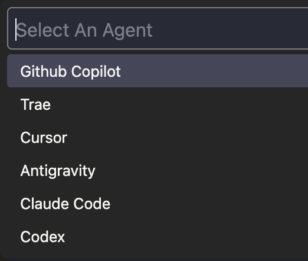

# CoBridge — 讓 AI 擁有"共享記憶"的次元橋✨

[English](../README.md) | [简体中文](README_CN.md) | [繁體中文](README_ZH_TW.md) | [日本語](README_JA.md) | [Français](README_FR.md) | [Español](README_ES.md) | [Português](README_PT.md) | [한국어](README_KO.md) | [Русский](README_RU.md) | [العربية](README_AR.md)


![codex](https://img.shields.io/badge/Codex-✓-5865F2?style=flat-square&logo=data:image/svg+xml;base64,PHN2ZyBmaWxsPSIjRkZGRkZGIiBmaWxsLXJ1bGU9ImV2ZW5vZGQiIGhlaWdodD0iMWVtIiBzdHlsZT0iZmxleDpub25lO2xpbmUtaGVpZ2h0OjEiIHZpZXdCb3g9IjAgMCAyNCAyNCIgd2lkdGg9IjFlbSIgeG1sbnM9Imh0dHA6Ly93d3cudzMub3JnLzIwMDAvc3ZnIj48dGl0bGU+Q29kZXg8L3RpdGxlPjxwYXRoIGNsaXAtcnVsZT0iZXZlbm9kZCIgZD0iTTguMDg2LjQ1N2E2LjEwNSA2LjEwNSAwIDAxMy4wNDYtLjQxNWMxLjMzMy4xNTMgMi41MjEuNzIgMy41NjQgMS43YS4xMTcuMTE3IDAgMDAuMTA3LjAyOWMxLjQwOC0uMzQ2IDIuNzYyLS4yMjQgNC4wNjEuMzY2bC4wNjMuMDMuMTU0LjA3NmMxLjM1Ny43MDMgMi4zMyAxLjc3IDIuOTE4IDMuMTk4LjI3OC42NzkuNDE4IDEuMzg4LjQyMSAyLjEyNmE1LjY1NSA1LjY1NSAwIDAxLS4xOCAxLjYzMS4xNjcuMTY3IDAgMDAuMDQuMTU1IDUuOTgyIDUuOTgyIDAgMDExLjU3OCAyLjg5MWMuMzg1IDEuOTAxLS4wMSAzLjYxNS0xLjE4MyA1LjE0bC0uMTgyLjIyYTYuMDYzIDYuMDYzIDAgMDEtMi45MzQgMS44NTEuMTYyLjE2MiAwIDAwLS4xMDguMTAyYy0uMjU1LjczNi0uNTExIDEuMzY0LS45ODcgMS45OTItMS4xOTkgMS41ODItMi45NjIgMi40NjItNC45NDggMi40NTEtMS41ODMtLjAwOC0yLjk4Ni0uNTg3LTQuMjEtMS43MzZhLjE0NS4xNDUgMCAwMC0uMTQtLjAzMmMtLjUxOC4xNjctMS4wNC4xOTEtMS42MDQuMTg1YTUuOTI0IDUuOTI0IDAgMDEtMi41OTUtLjYyMiA2LjA1OCA2LjA1OCAwIDAxLTIuMTQ2LTEuNzgxYy0uMjAzLS4yNjktLjQwNC0uNTIyLS41NTEtLjgyMWE3Ljc0IDcuNzQgMCAwMS0uNDk1LTEuMjgzIDYuMTEgNi4xMSAwIDAxLS4wMTctMy4wNjQuMTY2LjE2NiAwIDAwLjAwOC0uMDc0LjExNS4xMTUgMCAwMC0uMDM3LS4wNjQgNS45NTggNS45NTggMCAwMS0xLjM4LTIuMjAyIDUuMTk2IDUuMTk2IDAgMDEtLjMzMy0xLjU4OSA2LjkxNSA2LjkxNSAwIDAxLjE4OC0yLjEzMmMuNDUtMS40ODQgMS4zMDktMi42NDggMi41NzctMy40OTMuMjgyLS4xODguNTUtLjMzNC44MDItLjQzOC4yODYtLjEyLjU3My0uMjIuODYxLS4zMDRhLjEyOS4xMjkgMCAwMC4wODctLjA4N0E2LjAxNiA2LjAxNiAwIDAxNS42MzUgMi4zMUM2LjMxNSAxLjQ2NCA3LjEzMi44NDYgOC4wODYuNDU3em0tLjgwNCA3Ljg1YS44NDguODQ4IDAgMDAtMS40NzMuODQybDEuNjk0IDIuOTY1LTEuNjg4IDIuODQ4YS44NDkuODQ5IDAgMDAxLjQ2Ljg2NGwxLjk0LTMuMjcyYS44NDkuODQ5IDAgMDAuMDA3LS44NTRsLTEuOTQtMy4zOTN6bTUuNDQ2IDYuMjRhLjg0OS44NDkgMCAwMDAgMS42OTVoNC44NDhhLjg0OS44NDkgMCAwMDAtMS42OTZoLTQuODQ4eiI+PC9wYXRoPjwvc3ZnPg==)

[](https://open-vsx.org/extension/windfall/co-bridge)
[](https://open-vsx.org/extension/windfall/co-bridge)
[](https://marketplace.visualstudio.com/items?itemName=windfall.co-bridge)
[](https://github.com/Winddfall/CoBridge/blob/master/LICENSE)
[](https://github.com/Winddfall/CoBridge/stargazers)
[](https://github.com/Winddfall/CoBridge/commits/master)

> [!IMPORTANT]
> **CoBridge 需要搭配瀏覽器外掛 [Voyager](https://github.com/Nagi-ovo/gemini-voyager) 才能發揮作用**。
> CoBridge 負責在 IDE 端接收並管理上下文，Voyager 負責在網頁端抓取並發送對話內容。兩者"合體"後，你的 IDE 助手才能真正看懂網頁裡的聊天記錄！

**一邊在網頁端和 AI "頭腦風暴"，一邊在 IDE/CLI 裡讓 Agent 寫程式——卻發現它們彼此失憶？**

CoBridge 就是那座"次元橋"：它把你在瀏覽器裡與 AI 的聊天記錄，瞬間搬運到本地 ，讓 Copilot、Cursor、Claude Code 這些 Agent 也能讀懂你的思路。

> 大腦在雲端，雙手在本地——從此同頻呼吸。

---

## 🚀 四步起飛

### 1. 安裝 CoBridge

打開 Open VSX 插件市場，搜尋 [**CoBridge**](https://open-vsx.org/extension/windfall/co-bridge)，點擊安裝。就這麼簡單。

安裝完畢後，瞄一眼右下角狀態欄，出現圖示提示你選擇 Agent


點擊這個圖示，打開選單，你可以：
- 手動 **開/關** 服務  
- **查看日誌**（出問題先看這裡）  
- **打開同步檔案**（看看 AI 記住了什麼）
- **清空同步檔案**（清空 AI 的記憶）
- **選擇 Agent**（切換 Agent）

### 2. 選擇 Agent

打開選單，選擇你使用的 Agent


目前已支援 **6** 種編程 Agent：



選好 Agent 後，狀態欄會顯示對應的 Agent 圖示：


### 3. 開啟服務
回到選單，點擊開啟服務，服務會一直運行，直到你手動關閉


### 4. 開始"記憶搬運"

確保瀏覽器端的 **Voyager** 已開啟"上下文同步"功能。點擊 **同步到IDE**，對話內容就會自動落地到：

```
.cobridge/AI_CONTEXT.md
```

從此，你的 Agent 再也不會一臉茫然地問你「你之前說了什麼？」

---

## ⚙️ 連接埠被佔用了？換一個！

預設連接埠 `3030` 如果被其他程式"霸佔"了，改起來也很簡單：

1. 打開 VS Code 設置（`Ctrl + ,` / `Cmd + ,`）
2. 搜尋 `AIContextSync.port`
3. 把連接埠號碼改成你喜歡的數字（例如 `3031`）
4. 在狀態欄選單裡重啟一下服務，搞定！

**由於 vscode 會以工作區設置覆蓋使用者設置，所以請在工作區設置中修改連接埠號碼**


---

## 📋 你需要準備什麼

| 需求 | 說明 |
|------|------|
| **VS Code** | `1.50.0` 或更高版本 |
| **瀏覽器外掛** | 需要配套的 [Voyager](https://github.com/Nagi-ovo/gemini-voyager) 來抓取對話 |
| **網路** | 確保 `127.0.0.1` 沒被防火牆擋住 |

---

## 🎯 它的原則

- **零污染**：CoBridge 會自動把同步檔案加入 `.gitignore`，絕不污染你的 Git 倉庫。你的"悄悄話"只屬於你自己。
- **格式友好**：全 Markdown 輸出， Agent 讀起來就像讀說明書一樣絲滑。
- **自動配置**：它還會自動生成適配各類 Agent 的規則檔案，讓各路 Agent 無縫讀取上下文，不再臃腫。

---

## ⚡️ 支援生態 (Supported Ecosystem)


![Codex](https://img.shields.io/badge/Codex-5865F2?style=for-the-badge&logo=data:image/svg+xml;base64,PHN2ZyBmaWxsPSIjRkZGRkZGIiBmaWxsLXJ1bGU9ImV2ZW5vZGQiIGhlaWdodD0iMWVtIiBzdHlsZT0iZmxleDpub25lO2xpbmUtaGVpZ2h0OjEiIHZpZXdCb3g9IjAgMCAyNCAyNCIgd2lkdGg9IjFlbSIgeG1sbnM9Imh0dHA6Ly93d3cudzMub3JnLzIwMDAvc3ZnIj48dGl0bGU+Q29kZXg8L3RpdGxlPjxwYXRoIGNsaXAtcnVsZT0iZXZlbm9kZCIgZD0iTTguMDg2LjQ1N2E2LjEwNSA2LjEwNSAwIDAxMy4wNDYtLjQxNWMxLjMzMy4xNTMgMi41MjEuNzIgMy41NjQgMS43YS4xMTcuMTE3IDAgMDAuMTA3LjAyOWMxLjQwOC0uMzQ2IDIuNzYyLS4yMjQgNC4wNjEuMzY2bC4wNjMuMDMuMTU0LjA3NmMxLjM1Ny43MDMgMi4zMyAxLjc3IDIuOTE4IDMuMTk4LjI3OC42NzkuNDE4IDEuMzg4LjQyMSAyLjEyNmE1LjY1NSA1LjY1NSAwIDAxLS4xOCAxLjYzMS4xNjcuMTY3IDAgMDAuMDQuMTU1IDUuOTgyIDUuOTgyIDAgMDExLjU3OCAyLjg5MWMuMzg1IDEuOTAxLS4wMSAzLjYxNS0xLjE4MyA1LjE0bC0uMTgyLjIyYTYuMDYzIDYuMDYzIDAgMDEtMi45MzQgMS44NTEuMTYyLjE2MiAwIDAwLS4xMDguMTAyYy0uMjU1LjczNi0uNTExIDEuMzY0LS45ODcgMS45OTItMS4xOTkgMS41ODItMi45NjIgMi40NjItNC45NDggMi40NTEtMS41ODMtLjAwOC0yLjk4Ni0uNTg3LTQuMjEtMS43MzZhLjE0NS4xNDUgMCAwMC0uMTQtLjAzMmMtLjUxOC4xNjctMS4wNC4xOTEtMS42MDQuMTg1YTUuOTI0IDUuOTI0IDAgMDEtMi41OTUtLjYyMiA2LjA1OCA2LjA1OCAwIDAxLTIuMTQ2LTEuNzgxYy0uMjAzLS4yNjktLjQwNC0uNTIyLS41NTEtLjgyMWE3Ljc0IDcuNzQgMCAwMS0uNDk1LTEuMjgzIDYuMTEgNi4xMSAwIDAxLS4wMTctMy4wNjQuMTY2LjE2NiAwIDAwLjAwOC0uMDc0LjExNS4xMTUgMCAwMC0uMDM3LS4wNjQgNS45NTggNS45NTggMCAwMS0xLjM4LTIuMjAyIDUuMTk2IDUuMTk2IDAgMDEtLjMzMy0xLjU4OSA2LjkxNSA2LjkxNSAwIDAxLjE4OC0yLjEzMmMuNDUtMS40ODQgMS4zMDktMi42NDggMi41NzctMy40OTMuMjgyLS4xODguNTUtLjMzNC44MDItLjQzOC4yODYtLjEyLjU3My0uMjIuODYxLS4zMDRhLjEyOS4xMjkgMCAwMC4wODctLjA4N0E2LjAxNiA2LjAxNiAwIDAxNS42MzUgMi4zMUM2LjMxNSAxLjQ2NCA3LjEzMi44NDYgOC4wODYuNDU3em0tLjgwNCA3Ljg1YS44NDguODQ4IDAgMDAtMS40NzMuODQybDEuNjk0IDIuOTY1LTEuNjg4IDIuODQ4YS44NDkuODQ5IDAgMDAxLjQ2Ljg2NGwxLjk0LTMuMjcyYS44NDkuODQ5IDAgMDAuMDA3LS44NTRsLTEuOTQtMy4zOTN6bTUuNDQ2IDYuMjRhLjg0OS44NDkgMCAwMDAgMS42OTVoNC44NDhhLjg0OS44NDkgMCAwMDAtMS42OTZoLTQuODQ4eiI+PC9wYXRoPjwvc3ZnPg==)

---

## ⚠️ 已知的小脾氣

| 狀態 | 說明 |
|------|------|
| ✅ **已支援** | 網頁版 Gemini |
| ✅ **表格支援** | 已支援同步表格 |
| ✅ **圖片支援** | 已支援同步圖片 |
| ❌ **暫不支援** | 某些反爬嚴格或 DOM 結構複雜的平台（歡迎 PR！）|
| ❌ **檔案附件支援** | 暫不支援 |

---

## 🌟 一句話總結

**大模型從此不再失憶，在網頁端聊透方案，用 Agent 直接落地。**

如果你這個項目幫到了你，歡迎去 [GitHub](https://github.com/Winddfall/CoBridge) 點個 Star ⭐

## 💡 提問

如果你有新的需求，歡迎在 [GitHub](https://github.com/Winddfall/CoBridge/issues) 提 issue。

## 🤝 貢獻

如果你有好的建議或發現 bug，歡迎提交 Pull Request！

## 🥤 贊助此項目
<div align="center">
  <a href="https://github.com/winddfall/CoBridge">
    
  </a>
</div>

如果你這個項目解決了你的 AI 協作痛點，歡迎請我喝杯快樂水！🥤

你的支持將直接用於維持項目的後續迭代❤️。

<div align="center">
  
  <p><b>透過 微信 / 支付寶 / 愛發電 打賞:</b></p>
  <table align="center" border="0" cellpadding="0" cellspacing="0">
    <tr>
      <td align="center">
        <br>
        <sub><b>微信支付</b></sub>
      </td>
      <td align="center">
        <br>
        <sub><b>支付寶</b></sub>
      </td>
      <td align="center">
        <a href="https://afdian.com/a/Wind_fall" target="_blank">
          <picture>
            <source media="(prefers-color-scheme: dark)" srcset="https://afdian-connect.deno.dev/profile.svg?slug=Wind_fall&bg_color=%230d1117&text_color=%23dedbd7&border_color=%232e343d" />
            <source media="(prefers-color-scheme: light)" srcset="https://afdian-connect.deno.dev/profile.svg?slug=Wind_fall" />
            
          </picture>
        </a><br>
        <sub><b>愛發電</b></sub>
      </td>
    </tr>
  </table>
</div>

## 📄 許可證

該項目採用 MIT 許可證。
