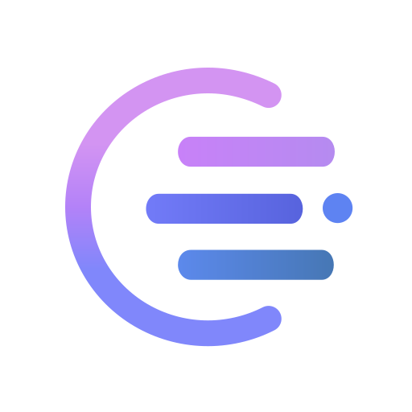
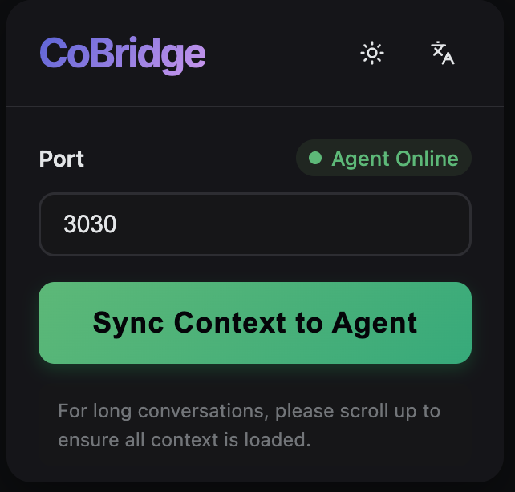

<div align="center">

#  차원을 초월하는 AI 메모리 동기화 ✨

**브라우저에서 생각하고, 에디터에서 실행하세요.**

당신의 Agent, 이제 탭을 넘나드는 장기 기억을 갖게 됩니다.


![ChatGPT](https://img.shields.io/badge/ChatGPT-✓-000?style=flat-square&logo=data:image/svg+xml;charset=utf-8;base64,PHN2ZyBmaWxsPSIjRkZGIiBmaWxsLXJ1bGU9ImV2ZW5vZGQiIGhlaWdodD0iMWVtIiBzdHlsZT0iZmxleDpub25lO2xpbmUtaGVpZ2h0OjEiIHZpZXdCb3g9IjAgMCAyNCAyNCIgd2lkdGg9IjFlbSIgeG1sbnM9Imh0dHA6Ly93d3cudzMub3JnLzIwMDAvc3ZnIj48dGl0bGU+T3BlbkFJPC90aXRsZT48cGF0aCBkPSJNOS4yMDUgOC42NTh2LTIuMjZjMC0uMTkuMDcyLS4zMzMuMjM4LS40MjhsNC41NDMtMi42MTZjLjYxOS0uMzU3IDEuMzU2LS41MjMgMi4xMTctLjUyMyAyLjg1NCAwIDQuNjYyIDIuMjEyIDQuNjYyIDQuNTY2IDAgLjE2NyAwIC4zNTctLjAyNC41NDdsLTQuNzEtMi43NTlhLjc5Ny43OTcgMCAwMC0uODU2IDBsLTUuOTcgMy40NzN6bTEwLjYwOSA4LjhWMTIuMDZjMC0uMzMzLS4xNDMtLjU3LS40MjktLjczN2wtNS45Ny0zLjQ3MyAxLjk1LTEuMTE4YS40MzMuNDMzIDAgMDEuNDc2IDBsNC41NDMgMi42MTdjMS4zMDkuNzYgMi4xODkgMi4zNzggMi4xODkgMy45NDggMCAxLjgwOC0xLjA3IDMuNDczLTIuNzYgNC4xNjN6TTcuODAyIDEyLjcwM2wtMS45NS0xLjE0MmMtLjE2Ny0uMDk1LS4yMzktLjIzOC0uMjM5LS40MjhWNS44OTljMC0yLjU0NSAxLjk1LTQuNDcyIDQuNTkxLTQuNDcyIDEgMCAxLjkyNy4zMzMgMi43MTIuOTI4TDguMjMgNS4wNjdjLS4yODUuMTY2LS40MjguNDA0LS40MjguNzM3djYuODk4ek0xMiAxNS4xMjhsLTIuNzk1LTEuNTd2LTMuMzNMMTIgOC42NThsMi43OTUgMS41N3YzLjMzTDEyIDE1LjEyOHptMS43OTYgNy4yM2MtMSAwLTEuOTI3LS4zMzItMi43MTItLjkyN2w0LjY4Ni0yLjcxMmMuMjg1LS4xNjYuNDI4LS40MDQuNDI4LS43Mzd2LTYuODk4bDEuOTc0IDEuMTQyYy4xNjcuMDk1LjIzOC4yMzguMjM4LjQyOHY1LjIzM2MwIDIuNTQ1LTEuOTc0IDQuNDcyLTQuNjE0IDQuNDcyem0tNS42MzctNS4zMDNsLTQuNTQ0LTIuNjE3Yy0xLjMwOC0uNzYxLTIuMTg4LTIuMzc4LTIuMTg4LTMuOTQ4QTQuNDgyIDQuNDgyIDAgMDE0LjIxIDYuMzI3djUuNDIzYzAgLjMzMy4xNDMuNTcxLjQyOC43MzhsNS45NDcgMy40NDktMS45NSAxLjExOGEuNDMyLjQzMiAwIDAxLS40NzYgMHptLS4yNjIgMy45Yy0yLjY4OCAwLTQuNjYyLTIuMDIxLTQuNjYyLTQuNTE5IDAtLjE5LjAyNC0uMzguMDQ3LS41N2w0LjY4NiAyLjcxYy4yODYuMTY3LjU3MS4xNjcuODU2IDBsNS45Ny0zLjQ0OHYyLjI2YzAgLjE5LS4wNy4zMzMtLjIzNy40MjhsLTQuNTQzIDIuNjE2Yy0uNjE5LjM1Ny0xLjM1Ni41MjMtMi4xMTcuNTIzem01Ljg5OSAyLjgzYTUuOTQ3IDUuOTQ3IDAgMDA1LjgyNy00Ljc1NkMyMi4yODcgMTguMzM5IDI0IDE1Ljg0IDI0IDEzLjI5NmMwLTEuNjY1LS43MTMtMy4yODItMS45OTgtNC40NDguMTE5LS41LjE5LS45OTkuMTktMS40OTggMC0zLjQwMS0yLjc1OS01Ljk0Ny01Ljk0Ni01Ljk0Ny0uNjQyIDAtMS4yNi4wOTUtMS44OC4zQUE1Ljk2MiA1Ljk2MiAwIDAwMTAuMjA1IDBhNS45NDcgNS45NDcgMCAwMC01LjgyNyA0Ljc1N0MxLjcxMyA1LjQ0NyAwIDcuOTQ1IDAgMTAuNDljMCAxLjY2Ni43MTMgMy4yODMgMS45OTggNC40NDgtLjExOS41LS4xOSAxLS4xOSAxLjQ5OSAwIDMuNDAxIDIuNzU5IDUuOTQ2IDUuOTQ2IDUuOTQ2LjY0MiAwIDEuMjYtLjA5NSAxLjg4LS4zMDlhNS45NiA1Ljk2IDAgMDA0LjE2MiAxLjcxM3oiPjwvcGF0aD48L3N2Zz4=)
![Claude](https://img.shields.io/badge/Claude-✓-D97757?style=flat-square&logo=data:image/svg+xml;charset=utf-8;base64,PHN2ZyBmaWxsPSIjRkZGIiBmaWxsLXJ1bGU9ImV2ZW5vZGQiIGhlaWdodD0iMWVtIiBzdHlsZT0iZmxleDpub25lO2xpbmUtaGVpZ2h0OjEiIHZpZXdCb3g9IjAgMCAyNCAyNCIgd2lkdGg9IjFlbSIgeG1sbnM9Imh0dHA6Ly93d3cudzMub3JnLzIwMDAvc3ZnIj48dGl0bGU+Q2xhdWRlPC90aXRsZT48cGF0aCBkPSJNNC43MDkgMTUuOTU1bDQuNzItMi42NDcuMDgtLjIzLS4wOC0uMTI4SDkuMmwtLjc5LS4wNDgtMi42OTgtLjA3My0yLjMzOS0uMDk3LTIuMjY2LS4xMjItLjU3MS0uMTIxTDAgMTEuNzg0bC4wNTUtLjM1Mi40OC0uMzIxLjY4Ni4wNiAxLjUyLjEwMyAyLjI3OC4xNTggMS42NTIuMDk3IDIuNDQ5LjI1NWguMzg5bC4wNTUtLjE1Ny0uMTM0LS4wOTgtLjEwMy0uMDk3LTIuMzU4LTEuNTk2LTIuNTUyLTEuNjg4LTEuMzM2LS45NzItLjcyNC0uNDkxLS4zNjQtLjQ2Mi0uMTU4LTEuMDA4LjY1Ni0uNzIyLjg4MS4wNi4yMjUuMDYxLjg5My42ODYgMS45MDggMS40NzYgMi40OTEgMS44MzMuMzY1LjMwNC4xNDUtLjEwMy4wMTktLjA3My0uMTY0LS4yNzQtMS4zNTUtMi40NDYtMS40NDYtMi40OS0uNjQ0LTEuMDMyLS4xNy0uNjE5YTIuOTcgMi45NyAwIDAxLS4xMDQtLjcyOUw2LjI4My4xMzQgNi42OTYgMGwuOTk2LjEzNC40Mi4zNjQuNjIgMS40MTQgMS4wMDIgMi4yMjkgMS41NTUgMy4wMy40NTYuODk4LjI0My44MzIuMDkxLjI1NWguMTU4VjkuMDFsLjEyOC0xLjcwNi4yMzctMi4wOTUuMjMtMi42OTUuMDgtLjc2LjM3Ni0uOTEuNzQ3LS40OTIuNTg0LjI4LjQ4LjY4NS0uMDY3LjQ0NC0uMjg2IDEuODUxLS41NTkgMi45MDMtLjM2NCAxLjk0MmguMjEybC4yNDMtLjI0Mi45ODUtMS4zMDYgMS42NTItMi4wNjQuNzMtLjgyLjg1LS45MDQuNTQ3LS40MzFoMS4wMzNsLjc2IDEuMTI5LS4zNCAxLjE2Ni0xLjA2NCAxLjM0Ny0uODgxIDEuMTQyLTEuMjY0IDEuNy0uNzkgMS4zNi4wNzMuMTEuMTg4LS4wMiAyLjg1Ni0uNjA2IDEuNTQzLS4yOCAxLjg0MS0uMzE1LjgzMy4zODguMDkxLjM5NS0uMzI4LjgwNy0xLjk2OS40ODYtMi4zMDkuNDYyLTMuNDM5LjgxMy0uMDQyLjAzLjA0OS4wNjEgMS41NDkuMTQ2LjY2Mi4wMzZoMS42MjJsMy4wMi4yMjUuNzkuNTIyLjQ3NC42MzgtLjA3OS40ODUtMS4yMTUuNjItMS42NC0uMzg5LTMuODI5LS45MS0xLjMxMi0uMzI5aC0uMTgydi4xMWwxLjA5MyAxLjA2OCAyLjAwNiAxLjgxIDIuNTA5IDIuMzMuMTI3LjU3OC0uMzIyLjQ1NS0uMzQtLjA0OS0yLjIwNS0xLjY1Ny0uODUxLS43NDctMS45MjYtMS42MmgtLjEyOHYuMTdsLjQ0NC42NDkgMi4zNDUgMy41MjEuMTIyIDEuMDgtLjE3LjM1My0uNjA4LjIxMy0uNjY4LS4xMjItMS4zNzQtMS45MjUtMS40MTUtMi4xNjctMS4xNDMtMS45NDMtLjE0LjA4LS42NzQgNy4yNTQtLjMxNi4zNy0uNzI5LjI4LS42MDctLjQ2MS0uMzIyLS43NDcuMzIyLTEuNDc2LjM4OS0xLjkyNC4zMTUtMS41My4yODYtMS45LjE3LS42MzItLjAxMi0uMDQyLS4xNC4wMTgtMS40MzQgMS45NjctMi4xOCAyLjk0NS0xLjcyNiAxLjg0NS0uNDE0LjE2NC0uNzE3LS4zNy4wNjctLjY2Mi40MDEtLjU4OSAyLjM4OC0zLjAzNiAxLjQ0LTEuODgyLjkzLTEuMDg2LS4wMDYtLjE1OGgtLjA1NUw0LjEzMiAxOC41NmwtMS4xMy4xNDYtLjQ4Ny0uNDU2LjA2MS0uNzQ2LjIzMS0uMjQzIDEuOTA4LTEuMzEyLS4wMDYuMDA2eiIgZmlsbC1ydWxlPSJub256ZXJvIj48L3BhdGg+PC9zdmc+)
![deepseek](https://img.shields.io/badge/DeepSeek-✓-4D6BFE?style=flat-square&logo=data:image/svg+xml;charset=utf-8;base64,PHN2ZyBoZWlnaHQ9IjFlbSIgc3R5bGU9ImZsZXg6bm9uZTtsaW5lLWhlaWdodDoxIiB2aWV3Qm94PSIwIDAgMjQgMjQiIHdpZHRoPSIxZW0iIHhtbG5zPSJodHRwOi8vd3d3LnczLm9yZy8yMDAwL3N2ZyI+PHRpdGxlPkRlZXBTZWVrPC90aXRsZT48cGF0aCBkPSJNMjMuNzQ4IDQuNDgyYy0uMjU0LS4xMjQtLjM2NC4xMTMtLjUxMi4yMzQtLjA1MS4wMzktLjA5NC4wOS0uMTM3LjEzNi0uMzcyLjM5Ny0uODA2LjY1Ny0xLjM3My42MjYtLjgyOS0uMDQ2LTEuNTM3LjIxNC0yLjE2My44NDgtLjEzMy0uNzgyLS41NzUtMS4yNDgtMS4yNDctMS41NDgtLjM1Mi0uMTU2LS43MDgtLjMxMS0uOTU1LS42NS0uMTcyLS4yNDEtLjIxOS0uNTEtLjMwNS0uNzc0LS4wNTUtLjE2LS4xMS0uMzIzLS4yOTMtLjM1LS4yLS4wMzEtLjI3OC4xMzYtLjM1Ni4yNzYtLjMxMy41NzItLjQzNCAxLjIwMi0uNDIyIDEuODQuMDI3IDEuNDM2LjYzMyAyLjU4IDEuODM4IDMuMzkzLjEzNy4wOTMuMTcuMTg3LjEyOS4zMjMtLjA4Mi4yOC0uMTguNTUyLS4yNjYuODMzLS4wNTUuMTc5LS4xMzcuMjE3LS4zMjkuMTQ1QTUuNTI2IDUuNTI2IDAgMDEtMS43MzYtMS4xOGMtLjg1Ny0uODI4LTEuNjMxLTEuNzQyLTIuNTk3LTIuNDU4YTExLjM2NSAxMS4zNjUgMCAwMC0uNjg5LS40NzFjLS45ODUtLjk1Ny4xMy0xLjc0My4zODgtMS44MzYuMjctLjA5OC4wOTMtLjQzMi0uNzc5LS40MjgtLjg3Mi4wMDQtMS42Ny4yOTUtMi42ODcuNjg0YTMuMDU1IDMuMDU1IDAgMDEtLjQ2NS4xMzcgOS41OTcgOS41OTcgMCAwMC0yLjg4My0uMTAyYy0xLjg4NS4yMS0zLjM5IDEuMTAyLTQuNDk3IDIuNjIzQy4wODIgOC42MDYtLjIzMSAxMC42ODQuMTUyIDEyLjg1Yy40MDMgMi4yODQgMS41NjkgNC4xNzUgMy4zNiA1LjY1MyAxLjg1OCAxLjUzMyAzLjk5NyAyLjI4NCA2LjQzOCAyLjE0IDEuNDgyLS4wODUgMy4xMzMtLjI4NCA0Ljk5NC0xLjg2LjQ3LjIzNC45NjIuMzI3IDEuNzguMzk3LjYzLjA1OSAxLjIzNi0uMDMgMS43MDUtLjEyOC43MzUtLjE1Ni42ODQtLjgzNy40MTktLjk2MS0yLjE1NS0xLjAwNC0xLjY4Mi0uNTk1LTIuMTEzLS45MjYgMS4wOTYtMS4yOTYgMi43NDYtMi42NDIgMy4zOTItNy4wMDMuMDUtLjM0Ny4wMDctLjU2NSAwLS44NDUtLjAwNC0uMTcuMDM1LS4yMzcuMjMtLjI1NmE0LjE3MyA0LjE3MyAwIDAwMS41NDUtLjQ3NWMxLjM5Ni0uNzYzIDEuOTYtMi4wMTUgMi4wOTMtMy41MTcuMDItLjIzLS4wMDQtLjQ2Ny0uMjQ3LS41ODh6TTExLjU4MSAxOGMtMi4wODktMS42NDItMy4xMDItMi4xODMtMy41Mi0yLjE2LS4zOTIuMDI0LS4zMjEuNDcxLS4yMzUuNzYzLjA5LjI4OC4yMDcuNDg2LjM3MS43MzkuMTE0LjE2Ny4xOTIuNDE2LS4xMTMuNjAzLS42NzMuNDE2LTEuODQyLS4xNC0xLjg5Ny0uMTY3LTEuMzYxLS44MDItMi41LTEuODYtMy4zMDEtMy4zMDctLjc3NC0xLjM5My0xLjIyNC0yLjg4Ny0xLjI5OC00LjQ4Mi0uMDItLjM4Ni4wOTMtLjUyMi40NzctLjU5MmE0LjY5NiA0LjY5NiAwIDAxMS41MjktLjAzOWMyLjEzMi4zMTIgMy45NDYgMS4yNjUgNS40NjggMi43NzQuODY4Ljg2IDEuNTI1IDEuODg3IDIuMjAyIDIuODkxLjcyIDEuMDY2IDEuNDk0IDIuMDgyIDIuNDggMi45MTQuMzQ4LjI5Mi42MjUuNTE0Ljg5MS42NzctLjgwMi4wOS0yLjE0LjExLTMuMDU0LS42MTR6bTEtNi40NGEuMzA2LjMwNiAwIDAxLjQxNS0uMjg3LjMwMi4zMDIgMCAwMS4yLjI4OC4zMDYuMzA2IDAgMDEtLjMxLjMwNy4zMDMuMzAzIDAgMDEtLjMwNC0uMzA4em0zLjExIDEuNTk2Yy0uMi4wODEtLjM5OS4xNTEtLjU5LjE2YTEuMjQ1IDEuMjQ1IDAgMDEtLjc5OC0uMjU0Yy0uMjc0LS4yMy0uNDctLjM1OC0uNTUyLS43NThhMS43MyAxLjczIDAgMDEuMDE2LS41ODhjLjA3LS4zMjctLjAwOC0uNTM3LS4yMzktLjcyNy0uMTg3LS4xNTYtLjQyNi0uMTk5LS42ODgtLjE5OWEuNTU5LjU1OSAwIDAxLS4yNTQtLjA3OGMtLjExLS4wNTQtLjItLjE5LS4xMTQtLjM1OC4wMjgtLjA1NC4xNi0uMTg2LjE5Mi0uMjEuMzU2LS4yMDIuNzY3LS4xMzYgMS4xNDYuMDE2LjM1Mi4xNDQuNjE4LjQwOCAxLjAwMS43ODIuMzkxLjQ1MS40NjIuNTc2LjY4NS45MTQuMTc2LjI2NS4zMzYuNTM3LjQ0NS44NDguMDY3LjE5NS0uMDE5LjM1NC0uMjUuNDUyeiIgZmlsbD0iI0ZGRiI+PC9wYXRoPjwvc3ZnPg==)
![Doubao](https://img.shields.io/badge/Doubao-✓-A569FF?style=flat-square&logo=data:image/svg+xml;charset=utf-8;base64,PHN2ZyBoZWlnaHQ9IjFlbSIgc3R5bGU9ImZsZXg6bm9uZTtsaW5lLWhlaWdodDoxIiB2aWV3Qm94PSIwIDAgMjQgMjQiIHdpZHRoPSIxZW0iIHhtbG5zPSJodHRwOi8vd3d3LnczLm9yZy8yMDAwL3N2ZyI+PHRpdGxlPkRvdWJhbzwvdGl0bGU+PHBhdGggZD0iTTUuMzEgMTUuNzU2Yy4xNzItMy43NSAxLjg4My01Ljk5OSAyLjU0OS02LjczOS0zLjI2IDIuMDU4LTUuNDI1IDUuNjU4LTYuMzU4IDguMzA4djEuMTJDMS41MDEgMjEuNTEzIDQuMjI2IDI0IDcuNTkgMjRhNi41OSA2LjU5IDAgMDAyLjItLjM3NWMuMzUzLS4xMi43LS4yNDggMS4wMzktLjM3OC45MTMtLjg5OSAxLjY1LTEuOTEgMi4yNDMtMi45OTItNC44NzcgMi40MzEtNy45NzQuMDcyLTcuNzYzLTQuNWwuMDAyLjAwMXoiIGZpbGw9IiNGRkYiPjwvcGF0aD48cGF0aCBkPSJNMjIuNTcgMTAuMjgzYy0xLjIxMi0uOTAxLTQuMTA5LTIuNDA0LTcuMzk3LTIuOC4yOTUgMy43OTIuMDkzIDguNzY2LTIuMSAxMi43NzNhMTIuNzgyIDEyLjc4MiAwIDAxLTIuMjQ0IDIuOTkyYzMuNzY0LTEuNDQ4IDYuNzQ2LTMuNDU3IDguNTk2LTUuMjE5IDIuODItMi42ODMgMy4zNTMtNS4xNzggMy4zNjEtNi42NmEyLjczNyAyLjczNyAwIDAwLS4yMTYtMS4wODR2LS4wMDJ6IiBmaWxsPSIjRkZGIj48L3BhdGg+PHBhdGggZD0iTTE0LjMwMyAxLjg2N0MxMi45NTUuNyAxMS4yNDggMCA5LjM5IDAgNy41MzIgMCA1Ljg4My42NzcgNC41NDUgMS44MDcgMi43OTEgMy4yOSAxLjYyNyA1LjU1NyAxLjUgOC4xMjV2OS4yMDFjLjkzMi0yLjY1IDMuMDk3LTYuMjUgNi4zNTctOC4zMDcuNS0uMzE4IDEuMDI1LS41OTUgMS41NjktLjgyOSAxLjg4My0uODAxIDMuODc4LS45MzIgNS43NDYtLjcwNi0uMjIyLTIuODMtLjcxOC01LjAwMi0uODctNS42MTdoLjAwMXoiIGZpbGw9IiNGRkYiPjwvcGF0aD48cGF0aCBkPSJNMTcuMzA1IDQuOTYxYTE5OS40NyAxOTkuNDcgMCAwMS0xLjA4LTEuMDk0Yy0uMjAyLS4yMTMtLjM5OC0uNDE5LS41ODYtLjYyMmwtMS4zMzMtMS4zNzhjLjE1MS42MTUuNjQ4IDIuNzg2Ljg2OSA1LjYxNyAzLjI4OC4zOTUgNi4xODUgMS44OTggNy4zOTYgMi44LTEuMzA2LTEuMjc1LTMuNDc1LTMuNDg3LTUuMjY2LTUuMzIzeiIgZmlsbD0iI0ZGRiI+PC9wYXRoPjwvc3ZnPg==)


![codex](https://img.shields.io/badge/Codex-✓-5865F2?style=flat-square&logo=data:image/svg+xml;base64,PHN2ZyBmaWxsPSIjRkZGRkZGIiBmaWxsLXJ1bGU9ImV2ZW5vZGQiIGhlaWdodD0iMWVtIiBzdHlsZT0iZmxleDpub25lO2xpbmUtaGVpZ2h0OjEiIHZpZXdCb3g9IjAgMCAyNCAyNCIgd2lkdGg9IjFlbSIgeG1sbnM9Imh0dHA6Ly93d3cudzMub3JnLzIwMDAvc3ZnIj48dGl0bGU+Q29kZXg8L3RpdGxlPjxwYXRoIGNsaXAtcnVsZT0iZXZlbm9kZCIgZD0iTTguMDg2LjQ1N2E2LjEwNSA2LjEwNSAwIDAxMy4wNDYtLjQxNWMxLjMzMy4xNTMgMi41MjEuNzIgMy41NjQgMS43YS4xMTcuMTE3IDAgMDAuMTA3LjAyOWMxLjQwOC0uMzQ2IDIuNzYyLS4yMjQgNC4wNjEuMzY2bC4wNjMuMDMuMTU0LjA3NmMxLjM1Ny43MDMgMi4zMyAxLjc3IDIuOTE4IDMuMTk4LjI3OC42NzkuNDE4IDEuMzg4LjQyMSAyLjEyNmE1LjY1NSA1LjY1NSAwIDAxLS4xOCAxLjYzMS4xNjcuMTY3IDAgMDAuMDQuMTU1IDUuOTgyIDUuOTgyIDAgMDExLjU3OCAyLjg5MWMuMzg1IDEuOTAxLS4wMSAzLjYxNS0xLjE4MyA1LjE0bC0uMTgyLjIyYTYuMDYzIDYuMDYzIDAgMDEtMi45MzQgMS44NTEuMTYyLjE2MiAwIDAwLS4xMDguMTAyYy0uMjU1LjczNi0uNTExIDEuMzY0LS45ODcgMS45OTItMS4xOTkgMS41ODItMi45NjIgMi40NjItNC45NDggMi40NTEtMS41ODMtLjAwOC0yLjk4Ni0uNTg3LTQuMjEtMS43MzZhLjE0NS4xNDUgMCAwMC0uMTQtLjAzMmMtLjUxOC4xNjctMS4wNC4xOTEtMS42MDQuMTg1YTUuOTI0IDUuOTI0IDAgMDEtMi41OTUtLjYyMiA2LjA1OCA2LjA1OCAwIDAxLTIuMTQ2LTEuNzgxYy0uMjAzLS4yNjktLjQwNC0uNTIyLS41NTEtLjgyMWE3Ljc0IDcuNzQgMCAwMS0uNDk1LTEuMjgzIDYuMTEgNi4xMSAwIDAxLS4wMTctMy4wNjQuMTY2LjE2NiAwIDAwLjAwOC0uMDc0LjExNS4xMTUgMCAwMC0uMDM3LS4wNjQgNS45NTggNS45NTggMCAwMS0xLjM4LTIuMjAyIDUuMTk2IDUuMTk2IDAgMDEtLjMzMy0xLjU4OSA2LjkxNSA2LjkxNSAwIDAxLjE4OC0yLjEzMmMuNDUtMS40ODQgMS4zMDktMi42NDggMi41NzctMy40OTMuMjgyLS4xODguNTUtLjMzNC44MDItLjQzOC4yODYtLjEyLjU3My0uMjIuODYxLS4zMDRhLjEyOS4xMjkgMCAwMC4wODctLjA4N0E2LjAxNiA2LjAxNiAwIDAxNS42MzUgMi4zMUM2LjMxNSAxLjQ2NCA3LjEzMi44NDYgOC4wODYuNDU3em0tLjgwNCA3Ljg1YS44NDguODQ4IDAgMDAtMS40NzMuODQybDEuNjk0IDIuOTY1LTEuNjg4IDIuODQ4YS44NDkuODQ5IDAgMDAxLjQ2Ljg2NGwxLjk0LTMuMjcyYS44NDkuODQ5IDAgMDAuMDA3LS44NTRsLTEuOTQtMy4zOTN6bTUuNDQ2IDYuMjRhLjg0OS44NDkgMCAwMDAgMS42OTVoNC44NDhhLjg0OS44NDkgMCAwMDAtMS42OTZoLTQuODQ4eiI+PC9wYXRoPjwvc3ZnPg==)

[](https://open-vsx.org/extension/windfall/co-bridge)
[](https://open-vsx.org/extension/windfall/co-bridge)
[](https://marketplace.visualstudio.com/items?itemName=windfall.co-bridge)
[](https://github.com/Winddfall/CoBridge/blob/main/LICENSE)
[](https://github.com/Winddfall/CoBridge/stargazers)

[English](../README.md) | [简体中文](README_CN.md) | [繁體中文](README_ZH_TW.md) | [日本語](README_JA.md) | [Français](README_FR.md) | [Español](README_ES.md) | [Português](README_PT.md) | [한국어](README_KO.md) | [Русский](README_RU.md) | [العربية](README_AR.md)

</div>

> [!NOTE]
> CoBridge는 **Gemini** 전용으로 설계된 브라우저 확장 프로그램 [Voyager](https://github.com/Nagi-ovo/gemini-voyager)도 지원합니다. Gemini만 사용한다면 Voyager가 가벼운 대안이 됩니다. 더 넓은 플랫폼 지원(ChatGPT, Claude, DeepSeek, Doubao)이 필요하면 CoBridge에 내장된 브라우저 확장 프로그램을 사용하세요.
---

## ✨ 기능

### 📝 스마트 컨텍스트 추출
웹 페이지에서 AI 대화 컨텍스트(텍스트, 테이블, 이미지)를 추출

### 🎯 시스템 프롬프트 자동 완성
워크스페이스 Agent의 시스템 프롬프트를 자동으로 입력하여 프로젝트를 빠르게 시작

### 🌿 다양한 에코시스템 지원
ChatGPT, Claude, DeepSeek, Doubao 등 다양한 AI 플랫폼 지원

GitHub Copilot, Cursor, Claude Code 등 IDE Agent 지원

---

## 📥 설치 방법
### 스토어에서 설치
#### 1단계: 브라우저 확장 프로그램 설치
[Chrome 웹 스토어]()에서 설치하세요(출시 예정)
#### 2단계: VS Code 확장 프로그램 설치
Open VSX Extension Marketplace를 열고 [**CoBridge**](https://open-vsx.org/extension/windfall/co-bridge)를 검색한 후 설치를 클릭하세요.

### 수동 설치
#### 브라우저 확장 프로그램 설치
1. 이 저장소를 다운로드하거나 클론하세요
2. 프로젝트 루트 디렉토리에서 `pnpm install && pnpm --filter chrome-extension build`를 실행하세요
3. `chrome://extensions/`를 열고 **개발자 모드**를 활성화하세요
4. **압축 해제된 확장 프로그램 로드**를 클릭하고 `packages/chrome-extension/dist`를 선택하세요

---

## 🏗️ 아키텍처

```
┌─────────────────────┐         ┌─────────────────────┐
│    브라우저 확장       │  HTTP   │     VS Code 확장     │
│   (Chrome / Edge)   │ ──────► │    (Agent 수신부)     │
│                     │ :3030   │                      │
│  웹 AI 대화 캡처      │         │   워크스페이스에 저장   │
│                     │         │ .cobridge/AI_CONTEXT │
└─────────────────────┘         └──────────────────────┘
```

- **브라우저 확장 프로그램**: AI 채팅 페이지에 주입되어 대화 내용(텍스트, 테이블, 이미지)을 추출하고 로컬 서버로 전송합니다
- **VS Code 확장 프로그램**: 로컬 HTTP 서버를 실행하여 데이터를 수신하고 Markdown 형식의 컨텍스트 파일로 IDE Agent가 읽을 수 있도록 작성합니다

---

## 🚀 빠른 시작
### 1단계: Agent 선택


상태 표시줄 아이콘을 클릭하여 관리 메뉴를 엽니다:


사용 중인 Agent를 선택하세요:


선택 후 상태 표시줄에 해당 Agent 아이콘이 표시됩니다:


### 2단계: 서비스 시작

메뉴에서 **서비스 시작**을 클릭하세요. 로컬 서버가 `3030` 포트에서 수동으로 중지할 때까지 실행됩니다.


### 3단계: 대화 동기화



1. 브라우저에서 지원되는 AI 채팅 페이지를 엽니다
2. CoBridge 브라우저 확장 프로그램 아이콘을 클릭합니다
3. **Sync Context to Agent**를 클릭합니다
4. 대화 내용이 워크스페이스의 `.cobridge/AI_CONTEXT.md`에 자동으로 기록됩니다

이제부터 당신의 Agent가 멍하니 쳐다보며 "아까 뭐라고 하셨죠?"라고 묻는 일은 없을 것입니다.

---

## ⚙️ 설정

### 포트 변경

`3030` 포트가 사용 중인 경우:

1. VS Code 설정을 엽니다 (`Ctrl + ,` / `Cmd + ,`)
2. `AIContextSync.port`를 검색합니다
3. 포트 번호를 변경합니다 (예: `3031`)
4. 상태 표시줄 메뉴에서 서비스를 다시 시작합니다


> **참고:** VS Code 워크스페이스 설정이 사용자 설정을 덮어씁니다. 포트를 변경하려면 워크스페이스 설정에서 수정하세요.

브라우저 확장 프로그램의 팝업에서도 포트를 설정할 수 있습니다. 양쪽을 일관되게 유지하세요.

---

## 🌐 지원되는 AI 플랫폼

![ChatGPT](https://img.shields.io/badge/ChatGPT-000000?style=for-the-badge&?style=flat-square&logo=data:image/svg+xml;charset=utf-8;base64,PHN2ZyBmaWxsPSIjRkZGIiBmaWxsLXJ1bGU9ImV2ZW5vZGQiIGhlaWdodD0iMWVtIiBzdHlsZT0iZmxleDpub25lO2xpbmUtaGVpZ2h0OjEiIHZpZXdCb3g9IjAgMCAyNCAyNCIgd2lkdGg9IjFlbSIgeG1sbnM9Imh0dHA6Ly93d3cudzMub3JnLzIwMDAvc3ZnIj48dGl0bGU+T3BlbkFJPC90aXRsZT48cGF0aCBkPSJNOS4yMDUgOC42NTh2LTIuMjZjMC0uMTkuMDcyLS4zMzMuMjM4LS40MjhsNC41NDMtMi42MTZjLjYxOS0uMzU3IDEuMzU2LS41MjMgMi4xMTctLjUyMyAyLjg1NCAwIDQuNjYyIDIuMjEyIDQuNjYyIDQuNTY2IDAgLjE2NyAwIC4zNTctLjAyNC41NDdsLTQuNzEtMi43NTlhLjc5Ny43OTcgMCAwMC0uODU2IDBsLTUuOTcgMy40NzN6bTEwLjYwOSA4LjhWMTIuMDZjMC0uMzMzLS4xNDMtLjU3LS40MjktLjczN2wtNS45Ny0zLjQ3MyAxLjk1LTEuMTE4YS40MzMuNDMzIDAgMDEuNDc2IDBsNC41NDMgMi42MTdjMS4zMDkuNzYgMi4xODkgMi4zNzggMi4xODkgMy45NDggMCAxLjgwOC0xLjA3IDMuNDczLTIuNzYgNC4xNjN6TTcuODAyIDEyLjcwM2wtMS45NS0xLjE0MmMtLjE2Ny0uMDk1LS4yMzktLjIzOC0uMjM5LS40MjhWNS44OTljMC0yLjU0NSAxLjk1LTQuNDcyIDQuNTkxLTQuNDcyIDEgMCAxLjkyNy4zMzMgMi43MTIuOTI4TDguMjMgNS4wNjdjLS4yODUuMTY2LS40MjguNDA0LS40MjguNzM3djYuODk4ek0xMiAxNS4xMjhsLTIuNzk1LTEuNTd2LTMuMzNMMTIgOC42NThsMi43OTUgMS41N3YzLjMzTDEyIDE1LjEyOHptMS43OTYgNy4yM2MtMSAwLTEuOTI3LS4zMzItMi43MTItLjkyN2w0LjY4Ni0yLjcxMmMuMjg1LS4xNjYuNDI4LS40MDQuNDI4LS43Mzd2LTYuODk4bDEuOTc0IDEuMTQyYy4xNjcuMDk1LjIzOC4yMzguMjM4LjQyOHY1LjIzM2MwIDIuNTQ1LTEuOTc0IDQuNDcyLTQuNjE0IDQuNDcyem0tNS42MzctNS4zMDNsLTQuNTQ0LTIuNjE3Yy0xLjMwOC0uNzYxLTIuMTg4LTIuMzc4LTIuMTg4LTMuOTQ4QTQuNDgyIDQuNDgyIDAgMDE0LjIxIDYuMzI3djUuNDIzYzAgLjMzMy4xNDMuNTcxLjQyOC43MzhsNS45NDcgMy40NDktMS45NSAxLjExOGEuNDMyLjQzMiAwIDAxLS40NzYgMHptLS4yNjIgMy45Yy0yLjY4OCAwLTQuNjYyLTIuMDIxLTQuNjYyLTQuNTE5IDAtLjE5LjAyNC0uMzguMDQ3LS41N2w0LjY4NiAyLjcxYy4yODYuMTY3LjU3MS4xNjcuODU2IDBsNS45Ny0zLjQ0OHYyLjI2YzAgLjE5LS4wNy4zMzMtLjIzNy40MjhsLTQuNTQzIDIuNjE2Yy0uNjE5LjM1Ny0xLjM1Ni41MjMtMi4xMTcuNTIzem01Ljg5OSAyLjgzYTUuOTQ3IDUuOTQ3IDAgMDA1LjgyNy00Ljc1NkMyMi4yODcgMTguMzM5IDI0IDE1Ljg0IDI0IDEzLjI5NmMwLTEuNjY1LS43MTMtMy4yODItMS45OTgtNC40NDguMTE5LS41LjE5LS45OTkuMTktMS40OTggMC0zLjQwMS0yLjc1OS01Ljk0Ny01Ljk0Ni01Ljk0Ny0uNjQyIDAtMS4yNi4wOTUtMS44OC4zMUE1Ljk2MiA1Ljk2MiAwIDAwMTAuMjA1IDBhNS45NDcgNS45NDcgMCAwMC01LjgyNyA0Ljc1N0MxLjcxMyA1LjQ0NyAwIDcuOTQ1IDAgMTAuNDljMCAxLjY2Ni43MTMgMy4yODMgMS45OTggNC40NDgtLjExOS41LS4xOSAxLS4xOSAxLjQ5OSAwIDMuNDAxIDIuNzU5IDUuOTQ2IDUuOTQ2IDUuOTQ2LjY0MiAwIDEuMjYtLjA5NSAxLjg4LS4zMDlhNS45NiA1Ljk2IDAgMDA0LjE2MiAxLjcxM3oiPjwvcGF0aD48L3N2Zz4=)
![Claude](https://img.shields.io/badge/Claude-D97757?style=for-the-badge&?style=flat-square&logo=data:image/svg+xml;charset=utf-8;base64,PHN2ZyBmaWxsPSIjRkZGIiBmaWxsLXJ1bGU9ImV2ZW5vZGQiIGhlaWdodD0iMWVtIiBzdHlsZT0iZmxleDpub25lO2xpbmUtaGVpZ2h0OjEiIHZpZXdCb3g9IjAgMCAyNCAyNCIgd2lkdGg9IjFlbSIgeG1sbnM9Imh0dHA6Ly93d3cudzMub3JnLzIwMDAvc3ZnIj48dGl0bGU+Q2xhdWRlPC90aXRsZT48cGF0aCBkPSJNNC43MDkgMTUuOTU1bDQuNzItMi42NDcuMDgtLjIzLS4wOC0uMTI4SDkuMmwtLjc5LS4wNDgtMi42OTgtLjA3My0yLjMzOS0uMDk3LTIuMjY2LS4xMjItLjU3MS0uMTIxTDAgMTEuNzg0bC4wNTUtLjM1Mi40OC0uMzIxLjY4Ni4wNiAxLjUyLjEwMyAyLjI3OC4xNTggMS42NTIuMDk3IDIuNDQ5LjI1NWguMzg5bC4wNTUtLjE1Ny0uMTM0LS4wOTgtLjEwMy0uMDk3LTIuMzU4LTEuNTk2LTIuNTUyLTEuNjg4LTEuMzM2LS45NzItLjcyNC0uNDkxLS4zNjQtLjQ2Mi0uMTU4LTEuMDA4LjY1Ni0uNzIyLjg4MS4wNi4yMjUuMDYxLjg5My42ODYgMS45MDggMS40NzYgMi40OTEgMS44MzMuMzY1LjMwNC4xNDUtLjEwMy4wMTktLjA3My0uMTY0LS4yNzQtMS4zNTUtMi40NDYtMS40NDYtMi40OS0uNjQ0LTEuMDMyLS4xNy0uNjE5YTIuOTcgMi45NyAwIDAxLS4xMDQtLjcyOUw2LjI4My4xMzQgNi42OTYgMGwuOTk2LjEzNC40Mi4zNjQuNjIgMS40MTQgMS4wMDIgMi4yMjkgMS41NTUgMy4wMy40NTYuODk4LjI0My44MzIuMDkxLjI1NWguMTU4VjkuMDFsLjEyOC0xLjcwNi4yMzctMi4wOTUuMjMtMi42OTUuMDgtLjc2LjM3Ni0uOTEuNzQ3LS40OTIuNTg0LjI4LjQ4LjY4NS0uMDY3LjQ0NC0uMjg2IDEuODUxLS41NTkgMi45MDMtLjM2NCAxLjk0MmguMjEybC4yNDMtLjI0Mi45ODUtMS4zMDYgMS42NTItMi4wNjQuNzMtLjgyLjg1LS45MDQuNTQ3LS40MzFoMS4wMzNsLjc2IDEuMTI5LS4zNCAxLjE2Ni0xLjA2NCAxLjM0Ny0uODgxIDEuMTQyLTEuMjY0IDEuNy0uNzkgMS4zNi4wNzMuMTEuMTg4LS4wMiAyLjg1Ni0uNjA2IDEuNTQzLS4yOCAxLjg0MS0uMzE1LjgzMy4zODguMDkxLjM5NS0uMzI4LjgwNy0xLjk2OS40ODYtMi4zMDkuNDYyLTMuNDM5LjgxMy0uMDQyLjAzLjA0OS4wNjEgMS41NDkuMTQ2LjY2Mi4wMzZoMS42MjJsMy4wMi4yMjUuNzkuNTIyLjQ3NC42MzgtLjA3OS40ODUtMS4yMTUuNjItMS42NC0uMzg5LTMuODI5LS45MS0xLjMxMi0uMzI5aC0uMTgydi4xMWwxLjA5MyAxLjA2OCAyLjAwNiAxLjgxIDIuNTA5IDIuMzMuMTI3LjU3OC0uMzIyLjQ1NS0uMzQtLjA0OS0yLjIwNS0xLjY1Ny0uODUxLS43NDctMS45MjYtMS42MmgtLjEyOHYuMTdsLjQ0NC42NDkgMi4zNDUgMy41MjEuMTIyIDEuMDgtLjE3LjM1My0uNjA4LjIxMy0uNjY4LS4xMjItMS4zNzQtMS45MjUtMS40MTUtMi4xNjctMS4xNDMtMS45NDMtLjE0LjA4LS42NzQgNy4yNTQtLjMxNi4zNy0uNzI5LjI4LS42MDctLjQ2MS0uMzIyLS43NDcuMzIyLTEuNDc2LjM4OS0xLjkyNC4zMTUtMS41My4yODYtMS45LjE3LS42MzItLjAxMi0uMDQyLS4xNC4wMTgtMS40MzQgMS45NjctMi4xOCAyLjk0NS0xLjcyNiAxLjg0NS0uNDE0LjE2NC0uNzE3LS4zNy4wNjctLjY2Mi40MDEtLjU4OSAyLjM4OC0zLjAzNiAxLjQ0LTEuODgyLjkzLTEuMDg2LS4wMDYtLjE1OGgtLjA1NUw0LjEzMiAxOC41NmwtMS4xMy4xNDYtLjQ4Ny0uNDU2LjA2MS0uNzQ2LjIzMS0uMjQzIDEuOTA4LTEuMzEyLS4wMDYuMDA2eiIgZmlsbC1ydWxlPSJub256ZXJvIj48L3BhdGg+PC9zdmc+)
![deepseek](https://img.shields.io/badge/DeepSeek-4D6BFE?style=for-the-badge&logo=data:image/svg+xml;charset=utf-8;base64,PHN2ZyBoZWlnaHQ9IjFlbSIgc3R5bGU9ImZsZXg6bm9uZTtsaW5lLWhlaWdodDoxIiB2aWV3Qm94PSIwIDAgMjQgMjQiIHdpZHRoPSIxZW0iIHhtbG5zPSJodHRwOi8vd3d3LnczLm9yZy8yMDAwL3N2ZyI+PHRpdGxlPkRlZXBTZWVrPC90aXRsZT48cGF0aCBkPSJNMjMuNzQ4IDQuNDgyYy0uMjU0LS4xMjQtLjM2NC4xMTMtLjUxMi4yMzQtLjA1MS4wMzktLjA5NC4wOS0uMTM3LjEzNi0uMzcyLjM5Ny0uODA2LjY1Ny0xLjM3My42MjYtLjgyOS0uMDQ2LTEuNTM3LjIxNC0yLjE2My44NDgtLjEzMy0uNzgyLS41NzUtMS4yNDgtMS4yNDctMS41NDgtLjM1Mi0uMTU2LS43MDgtLjMxMS0uOTU1LS42NS0uMTcyLS4yNDEtLjIxOS0uNTEtLjMwNS0uNzc0LS4wNTUtLjE2LS4xMS0uMzIzLS4yOTMtLjM1LS4yLS4wMzEtLjI3OC4xMzYtLjM1Ni4yNzYtLjMxMy41NzItLjQzNCAxLjIwMi0uNDIyIDEuODQuMDI3IDEuNDM2LjYzMyAyLjU4IDEuODM4IDMuMzkzLjEzNy4wOTMuMTcyLjE4Ny4xMjkuMzIzLS4wODIuMjgtLjE4LjU1Mi0uMjY2LjgzMy0uMDU1LjE3OS0uMTM3LjIxNy0uMzI5LjE0YTUuNTI2IDUuNTI2IDAgMDEtMS43MzYtMS4xOGMtLjg1Ny0uODI4LTEuNjMxLTEuNzQyLTIuNTk3LTIuNDU4YTExLjM2NSAxMS4zNjUgMCAwMC0uNjg5LS40NzFjLS45ODUtLjk1Ny4xMy0xLjc0My4zODgtMS44MzYuMjctLjA5OC4wOTMtLjQzMi0uNzc5LS40MjgtLjg3Mi4wMDQtMS42Ny4yOTUtMi42ODcuNjg0YTMuMDU1IDMuMDU1IDAgMDEtLjQ2NS4xMzcgOS41OTcgOS41OTcgMCAwMC0yLjg4My0uMTAyYy0xLjg4NS4yMS0zLjM5IDEuMTAyLTQuNDk3IDIuNjIzQy4wODIgOC42MDYtLjIzMSAxMC42ODQuMTUyIDEyLjg1Yy40MDMgMi4yODQgMS41NjkgNC4xNzUgMy4zNiA1LjY1MyAxLjg1OCAxLjUzMyAzLjk5NyAyLjI4NCA2LjQzOCAyLjE0IDEuNDgyLS4wODUgMy4xMzMtLjI4NCA0Ljk5NC0xLjg2LjQ3LjIzNC45NjIuMzI3IDEuNzguMzk3LjYzLjA1OSAxLjIzNi0uMDMgMS43MDUtLjEyOC43MzUtLjE1Ni42ODQtLjgzNy40MTktLjk2MS0yLjE1NS0xLjAwNC0xLjY4Mi0uNTk1LTIuMTEzLS45MjYgMS4wOTYtMS4yOTYgMi43NDYtMi42NDIgMy4zOTItNy4wMDMuMDUtLjM0Ny4wMDctLjU2NSAwLS44NDUtLjAwNC0uMTcuMDM1LS4yMzcuMjMtLjI1NmE0LjE3MyA0LjE3MyAwIDAwMS41NDUtLjQ3NWMxLjM5Ni0uNzYzIDEuOTYtMi4wMTUgMi4wOTMtMy41MTcuMDItLjIzLS4wMDQtLjQ2Ny0uMjQ3LS41ODh6TTExLjU4MSAxOGMtMi4wODktMS42NDItMy4xMDItMi4xODMtMy41Mi0yLjE2LS4zOTIuMDI0LS4zMjEuNDcxLS4yMzUuNzYzLjA5LjI4OC4yMDcuNDg2LjM3MS43MzkuMTE0LjE2Ny4xOTIuNDE2LS4xMTMuNjAzLS42NzMuNDE2LTEuODQyLS4xNC0xLjg5Ny0uMTY3LTEuMzYxLS44MDItMi41LTEuODYtMy4zMDEtMy4zMDctLjc3NC0xLjM5My0xLjIyNC0yLjg4Ny0xLjI5OC00LjQ4Mi0uMDItLjM4Ni4wOTMtLjUyMi40NzctLjU5MmE0LjY5NiA0LjY5NiAwIDAxMS41MjktLjAzOWMyLjEzMi4zMTIgMy45NDYgMS4yNjUgNS40NjggMi43NzQuODY4Ljg2IDEuNTI1IDEuODg3IDIuMjAyIDIuODkxLjcyIDEuMDY2IDEuNDk0IDIuMDgyIDIuNDggMi45MTQuMzQ4LjI5Mi42MjUuNTE0Ljg5MS42NzctLjgwMi4wOS0yLjE0LjExLTMuMDU0LS42MTR6bTEtNi40NGEuMzA2LjMwNiAwIDAxLjQxNS0uMjg3LjMwMi4zMDIgMCAwMS4yLjI4OC4zMDYuMzA2IDAgMDEtLjMxLjMwNy4zMDMuMzAzIDAgMDEtLjMwNC0uMzA4em0zLjExIDEuNTk2Yy0uMi4wODEtLjM5OS4xNTEtLjU5LjE2YTEuMjQ1IDEuMjQ1IDAgMDEtLjc5OC0uMjU0Yy0uMjc0LS4yMy0uNDctLjM1OC0uNTUyLS43NThhMS43MyAxLjczIDAgMDEuMDE2LS41ODhjLjA3LS4zMjctLjAwOC0uNTM3LS4yMzktLjcyNy0uMTg3LS4xNTYtLjQyNi0uMTk5LS42ODgtLjE5OWEuNTU5LjU1OSAwIDAxLS4yNTQtLjA3OGMtLjExLS4wNTQtLjItLjE5LS4xMTQtLjM1OC4wMjgtLjA1NC4xNi0uMTg2LjE5Mi0uMjEuMzU2LS4yMDIuNzY3LS4xMzYgMS4xNDYuMDE2LjM1Mi4xNDQuNjE4LjQwOCAxLjAwMS43ODIuMzkxLjQ1MS40NjIuNTc2LjY4NS45MTQuMTc2LjI2NS4zMzYuNTM3LjQ0NS44NDguMDY3LjE5NS0uMDE5LjM1NC0uMjUuNDUyeiIgZmlsbD0iI0ZGRiI+PC9wYXRoPjwvc3ZnPg==)
![豆包](https://img.shields.io/badge/Doubao-A569FF?style=for-the-badge&?style=flat-square&logo=data:image/svg+xml;charset=utf-8;base64,PHN2ZyBoZWlnaHQ9IjFlbSIgc3R5bGU9ImZsZXg6bm9uZTtsaW5lLWhlaWdodDoxIiB2aWV3Qm94PSIwIDAgMjQgMjQiIHdpZHRoPSIxZW0iIHhtbG5zPSJodHRwOi8vd3d3LnczLm9yZy8yMDAwL3N2ZyI+PHRpdGxlPkRvdWJhbzwvdGl0bGU+PHBhdGggZD0iTTUuMzEgMTUuNzU2Yy4xNzItMy43NSAxLjg4My01Ljk5OSAyLjU0OS02LjczOS0zLjI2IDIuMDU4LTUuNDI1IDUuNjU4LTYuMzU4IDguMzA4djEuMTJDMS41MDEgMjEuNTEzIDQuMjI2IDI0IDcuNTkgMjRhNi41OSA2LjU5IDAgMDAyLjItLjM3NWMuMzUzLS4xMi43LS4yNDggMS4wMzktLjM3OC45MTMtLjg5OSAxLjY1LTEuOTEgMi4yNDMtMi45OTItNC44NzcgMi40MzEtNy45NzQuMDcyLTcuNzYzLTQuNWwuMDAyLjAwMXoiIGZpbGw9IiNGRkYiPjwvcGF0aD48cGF0aCBkPSJNMjIuNTcgMTAuMjgzYy0xLjIxMi0uOTAxLTQuMTA5LTIuNDA0LTcuMzk3LTIuOC4yOTUgMy43OTIuMDkzIDguNzY2LTIuMSAxMi43NzNhMTIuNzgyIDEyLjc4MiAwIDAxLTIuMjQ0IDIuOTkyYzMuNzY0LTEuNDQ4IDYuNzQ2LTMuNDU3IDguNTk2LTUuMjE5IDIuODItMi42ODMgMy4zNTMtNS4xNzggMy4zNjEtNi42NmEyLjczNyAyLjczNyAwIDAwLS4yMTYtMS4wODR2LS4wMDJ6IiBmaWxsPSIjRkZGIj48L3BhdGg+PHBhdGggZD0iTTE0LjMwMyAxLjg2N0MxMi45NTUuNyAxMS4yNDggMCA5LjM5IDAgNy41MzIgMCA1Ljg4My42NzcgNC41NDUgMS44MDcgMi43OTEgMy4yOSAxLjYyNyA1LjU1NyAxLjUgOC4xMjV2OS4yMDFjLjkzMi0yLjY1IDMuMDk3LTYuMjUgNi4zNTctOC4zMDcuNS0uMzE4IDEuMDI1LS41OTUgMS41NjktLjgyOSAxLjg4My0uODAxIDMuODc4LS45MzIgNS43NDYtLjcwNi0uMjIyLTIuODMtLjcxOC01LjAwMi0uODctNS42MTdoLjAwMXoiIGZpbGw9IiNGRkYiPjwvcGF0aD48cGF0aCBkPSJNMTcuMzA1IDQuOTYxYTE5OS40NyAxOTkuNDcgMCAwMS0xLjA4LTEuMDk0Yy0uMjAyLS4yMTMtLjM5OC0uNDE5LS41ODYtLjYyMmwtMS4zMzMtMS4zNzhjLjE1MS42MTUuNjQ4IDIuNzg2Ljg2OSA1LjYxNyAzLjI4OC4zOTUgNi4xODUgMS44OTggNy4zOTYgMi44LTEuMzA2LTEuMjc1LTMuNDc1LTMuNDg3LTUuMjY2LTUuMzIzeiIgZmlsbD0iI0ZGRiI+PC9wYXRoPjwvc3ZnPg==)
|  | 상태 | 설명 |
|------|------|------|
| **테이블 지원** | ✅ | 테이블이 자동으로 Markdown으로 변환 |
| **이미지 지원** | ✅ | 이미지가 자동으로 로컬에 저장 |
| **파일 첨부** | ❌ | 현재 지원되지 않음 |
| **기타 플랫폼** | ❌ | 스크래핑 방지가 엄격한 플랫폼은 지원되지 않음 (PR 환영!) |

---

## 🤖 지원되는 Agent


![Codex](https://img.shields.io/badge/Codex-5865F2?style=for-the-badge&logo=data:image/svg+xml;base64,PHN2ZyBmaWxsPSIjRkZGRkZGIiBmaWxsLXJ1bGU9ImV2ZW5vZGQiIGhlaWdodD0iMWVtIiBzdHlsZT0iZmxleDpub25lO2xpbmUtaGVpZ2h0OjEiIHZpZXdCb3g9IjAgMCAyNCAyNCIgd2lkdGg9IjFlbSIgeG1sbnM9Imh0dHA6Ly93d3cudzMub3JnLzIwMDAvc3ZnIj48dGl0bGU+Q29kZXg8L3RpdGxlPjxwYXRoIGNsaXAtcnVsZT0iZXZlbm9kZCIgZD0iTTguMDg2LjQ1N2E2LjEwNSA2LjEwNSAwIDAxMy4wNDYtLjQxNWMxLjMzMy4xNTMgMi41MjEuNzIgMy41NjQgMS43YS4xMTcuMTE3IDAgMDAuMTA3LjAyOWMxLjQwOC0uMzQ2IDIuNzYyLS4yMjQgNC4wNjEuMzY2bC4wNjMuMDMuMTU0LjA3NmMxLjM1Ny43MDMgMi4zMyAxLjc3IDIuOTE4IDMuMTk4LjI3OC42NzkuNDE4IDEuMzg4LjQyMSAyLjEyNmE1LjY1NSA1LjY1NSAwIDAxLS4xOCAxLjYzMS4xNjcuMTY3IDAgMDAuMDQuMTU1IDUuOTgyIDUuOTgyIDAgMDExLjU3OCAyLjg5MWMuMzg1IDEuOTAxLS4wMSAzLjYxNS0xLjE4MyA1LjE0bC0uMTgyLjIyYTYuMDYzIDYuMDYzIDAgMDEtMi45MzQgMS44NTEuMTYyLjE2MiAwIDAwLS4xMDguMTAyYy0uMjU1LjczNi0uNTExIDEuMzY0LS45ODcgMS45OTItMS4xOTkgMS41ODItMi45NjIgMi40NjItNC45NDggMi40NTEtMS41ODMtLjAwOC0yLjk4Ni0uNTg3LTQuMjEtMS43MzZhLjE0NS4xNDUgMCAwMC0uMTQtLjAzMmMtLjUxOC4xNjctMS4wNC4xOTEtMS42MDQuMTg1YTUuOTI0IDUuOTI0IDAgMDEtMi41OTUtLjYyMiA2LjA1OCA2LjA1OCAwIDAxLTIuMTQ2LTEuNzgxYy0uMjAzLS4yNjktLjQwNC0uNTIyLS41NTEtLjgyMWE3Ljc0IDcuNzQgMCAwMS0uNDk1LTEuMjgzIDYuMTEgNi4xMSAwIDAxLS4wMTctMy4wNjQuMTY2LjE2NiAwIDAwLjAwOC0uMDc0LjExNS4xMTUgMCAwMC0uMDM3LS4wNjQgNS45NTggNS45NTggMCAwMS0xLjM4LTIuMjAyIDUuMTk2IDUuMTk2IDAgMDEtLjMzMy0xLjU4OSA2LjkxNSA2LjkxNSAwIDAxLjE4OC0yLjEzMmMuNDUtMS40ODQgMS4zMDktMi42NDggMi41NzctMy40OTMuMjgyLS4xODguNTUtLjMzNC44MDItLjQzOC4yODYtLjEyLjU3My0uMjIuODYxLS4zMDRhLjEyOS4xMjkgMCAwMC4wODctLjA4N0E2LjAxNiA2LjAxNiAwIDAxNS42MzUgMi4zMUM2LjMxNSAxLjQ2NCA3LjEzMi44NDYgOC4wODYuNDU3em0tLjgwNCA3Ljg1YS44NDguODQ4IDAgMDAtMS40NzMuODQybDEuNjk0IDIuOTY1LTEuNjg4IDIuODQ4YS44NDkuODQ5IDAgMDAxLjQ2Ljg2NGwxLjk0LTMuMjcyYS44NDkuODQ5IDAgMDAuMDA3LS44NTRsLTEuOTQtMy4zOTN6bTUuNDQ2IDYuMjRhLjg0OS44NDkgMCAwMDAgMS42OTVoNC44NDhhLjg0OS44NDkgMCAwMDAtMS42OTZoLTQuODQ4eiI+PC9wYXRoPjwvc3ZnPg==)

---

## 🎯 설계 원칙

- **오염 제로**: CoBridge는 동기화된 파일을 자동으로 `.gitignore`에 추가하여 Git 저장소가 오염되지 않도록 보장합니다.
- **친숙한 형식**: 완전한 Markdown 출력 — 테이블, 이미지, 텍스트가 모두 보존되어 IDE Agent가 자연스럽게 읽을 수 있습니다.
- **자동 설정**: 각 Agent에 맞는 규칙 파일을 자동으로 생성하여 컨텍스트를 원활하게 읽을 수 있게 합니다.
- **로컬 우선**: 모든 데이터가 사용자의 머신에 머무르며, 외부 서버도, 원격 분석도 없습니다.

---

## 📁 프로젝트 구조

이 프로젝트는 두 개의 서브 패키지를 포함하는 [pnpm workspace](https://pnpm.io/workspaces) Monorepo입니다:

```
CoBridge/
├── packages/
│   ├── chrome-extension/     # 브라우저 확장 프로그램 (Chrome / Edge)
│   └── vscode-extension/     # VS Code 확장 프로그램 (Agent 수신부)
├── pnpm-workspace.yaml
└── package.json
```

---

## 🛠️ 개발

### 환경 요구 사항

- [Node.js](https://nodejs.org/) >= 20
- [pnpm](https://pnpm.io/) >= 8

### 설치

```bash
git clone https://github.com/Winddfall/CoBridge.git
cd CoBridge
pnpm install
```

### 브라우저 확장 프로그램 빌드

```bash
pnpm --filter chrome-extension build
```

### VS Code 확장 프로그램 빌드

```bash
pnpm --filter vscode-extension compile
```

---

## 🌟 한 줄 요약

**대형 모델이 더 이상 기억을 잃지 않습니다: 웹에서 충분히 생각하고 Agent가 직접 구현하게 하세요.**

이 프로젝트가 도움이 되었다면 [GitHub](https://github.com/Winddfall/CoBridge)에서 별을 눌러주세요 ⭐.

## 💡 문제 피드백

새로운 요구 사항이 있으시면 [GitHub](https://github.com/Winddfall/CoBridge/issues)에서 Issue를 열어주세요.

## 🤝 기여

좋은 제안이 있거나 버그를 발견하시면 Pull Request를 환영합니다!

## 🥤 프로젝트 후원
<div align="center">
  <a href="https://github.com/Winddfall/CoBridge">
    
  </a>
</div>
이 프로젝트가 AI 협업의 고통을 해결해 주었다면, 커피 한 잔 사주세요! ☕

여러분의 지원은 프로젝트의 향후 반복에 직접 사용됩니다 ❤️.

<div align="center">

  <p><b>WeChat / Alipay / Afdian으로 후원:</b></p>
  <table align="center" border="0" cellpadding="0" cellspacing="0">
    <tr>
      <td align="center">
        <br>
        <sub><b>WeChat Pay</b></sub>
      </td>
      <td align="center">
        <br>
        <sub><b>Alipay</b></sub>
      </td>
      <td align="center">
        <a href="https://afdian.com/a/Wind_fall" target="_blank"><b>Afdian</b></a><br>
        <sub><b>Afdian</b></sub>
      </td>
    </tr>
  </table>
</div>

## 📄 라이선스

이 프로젝트는 MIT 라이선스에 따라 사용이 허가됩니다.

## Star 추세

<a href="https://www.star-history.com/?repos=Winddfall%2FCoBridge&type=date&legend=top-left">
 <picture>
   <source media="(prefers-color-scheme: dark)" srcset="https://api.star-history.com/image?repos=Winddfall/CoBridge&type=date&theme=dark&legend=top-left" />
   <source media="(prefers-color-scheme: light)" srcset="https://api.star-history.com/image?repos=Winddfall/CoBridge&type=date&legend=top-left" />
   
 </picture>
</a>
